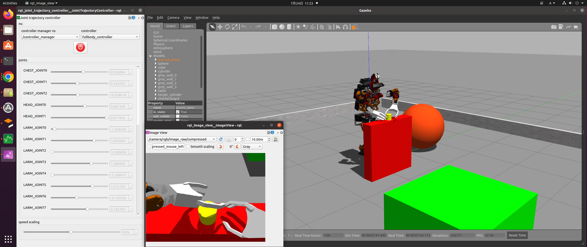

robot-programming [](https://app.travis-ci.com/jsk-enshu/robot-programming) [](https://gitter.im/jsk-enshu/robot-programming?utm_source=badge&utm_medium=badge&utm_campaign=pr-badge&utm_content=badge)
=================

This is exercise for robot-programming.

# ROS2 Jazzy (Recommended)

## ⚠️ **重要: ネットワーク設定**

**<span style="color:red">演習中や同一ネットワークで複数人が ROS2 を起動すると、通信が相互に干渉してしまいます。</span>**
**<span style="color:red">必ず以下の環境変数を設定してください:</span>**

```bash
export ROS_LOCALHOST_ONLY=1
```

**bashrc に追加して永続化する場合:**

```bash
echo 'export ROS_LOCALHOST_ONLY=1' >> ~/.bashrc
source ~/.bashrc
```

## JEDY Robot - Dual-arm Mobile Manipulator

For ROS2 Jazzy users, see **[jedy/README.md](./jedy/README.md)** for the JEDY robot simulation.

### Setup

```bash
# Create workspace
mkdir -p ~/ros2_ws/src
cd ~/ros2_ws/src

# Clone this repository
git clone https://github.com/jsk-enshu/robot-programming.git

# Import dependencies using vcs
cd ~/ros2_ws
sudo apt install -y python3-vcstool
vcs import src < src/robot-programming/.repos.jazzy

# Install dependencies
rosdep update
rosdep install --from-paths src --ignore-src -y -r

# Build
colcon build --symlink-install
source install/setup.bash

# Launch simulation with RViz
ros2 launch jedy_bringup jedy_gazebo.launch.py
```

---

# ROS1 (Deprecated)

**Note**: The following sections are for ROS1 and are deprecated. Please use ROS2 Jazzy with JEDY robot above.

# Setup
-----

```
$ source /opt/ros/noetic/setup.bash
$ mkdir -p ~/catkin_ws/src
$ cd ~/catkin_ws/src
$ git clone https://github.com/jsk-enshu/robot-programming
$ wstool init .
$ wstool merge robot-programming/.rosinstall.${ROS_DISTRO}
$ wstool update
$ rosdep update
$ cd ..
$ rosdep install --from-paths src --ignore-src -y -r
# You will get a warning because some packages (turtlebot_bringup, turtlebot_dashboard, turtlebot_rapps, and kobuki_capabilities) have not resolved the rosdep key, but you can ignore it.
$ catkin build
# $ echo 'source ~/catkin_ws/devel/setup.bash' >> ~/.bashrc ## You may source the setup.bash by this line if you understand the difference between > and >>.
```

# Turtlebot simulation
## Start simulator
---------------
```
$ source ~/catkin_ws/devel/setup.bash
$ roslaunch dxl_armed_turtlebot dxl_armed_turtlebot_gazebo.launch
```

## Start RQT GUI
-------------
```
$ roscd dxl_armed_turtlebot/launch

$ rqt --perspective-file enshu.perspective
```

## Start Color Tracking node
-------------------------
```
$ roslaunch opencv_apps camshift.launch image:=/camera/rgb/image_raw
$ rosrun image_view2 image_view2 image:=/camera/rgb/image_raw ~image_transport:=compressed
```

## Start Checkerboard Tracking Tracking node
-----------------------------------------
```
$ roslaunch roseus_tutorials checkerboard-detector.launch rect0_size_x:=0.02 rect0_size_y:=0.02 \
      grid0_size_x:=7 grid0_size_y:=4 translation0:="0 0 0" \
      image:=image_raw  group:=/camera/rgb frame_id:=camera_rgb_optical_frame
$ ROS_NAMESPACE=/camera/rgb rosrun checkerboard_detector objectdetection_tf_publisher.py \
       _use_simple_tf:=true
```

# cart_humanoid (JAXON) simulation


## Start simulator
---------------
```
$ source ~/catkin_ws/devel/setup.bash
$ roslaunch cart_humanoid cart_humanoid_gazebo.launch
# It may take a few minutes to start the simulator for the first time.
# If you launch simulators with the robot's base link unfixed, use the following command instead.
$ roslaunch cart_humanoid cart_humanoid_gazebo.launch fix_base_link:=false
```

## Start RQT GUI
-------------
```
$ rosrun rqt_joint_trajectory_controller rqt_joint_trajectory_controller
```

# Documentations
----------------


See online [manual](http://jsk-enshu.github.io/robot-programming/) for Euslisp models and interfaces.

PDF files are also available from [here](http://jsk-enshu.github.io/robot-programming/robot_programming_manual.pdf)

