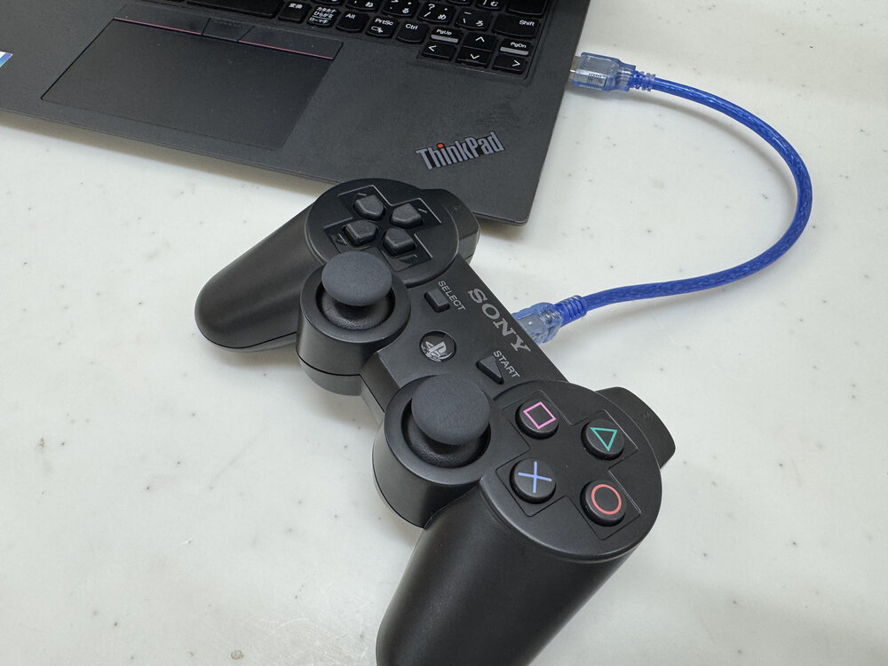

# 1日目 双腕移動台車ロボットを用いた認識操作プログラミング

## 演習の進め方と各演習でのチェック項目

各演習ではまずこちらから内容について概説し
資料を読みながらロボットを実際に動かすことで進めてもらう．
演習を通してにある実行プロセス(四角枠)を実際に実行してもらい
**ロボットのアーム，台車を動かす，センサ情報を取得する，シミュレータを起動する**
にはどうすればいいのかを体感しながら
ロボットの知能行動をプログラミングする方法の
全体像をつかんで貰うのが演習の目的である．
複雑に見えるかもしれないが本章のチェックポイントを着実にこなせば
実行できるはずである．

資料にはいくつかチェックポイントがあるのでそれを確認しながら演習を進める．
各チェックポイントはその日の必須課題となっているので実行結果の画面などをスクリーンショットや写真で保存しておくとよい．
各チェックポイントを確認し終えたら進捗報告シート(Googleスプレッドシートを予定)に記入していくこと．
各チェックポイントに書いてあることができない場合次回以降の演習遂行が困難になるのでうまくいかなければTAを呼んで解決し先に進んで欲しい．また
**ロボットシステムの講義で扱ったROS (Robot Operating System)およびPythonやEusLisp** をある程度習得していることを前提に進めるが
これらに関することも遠慮なく質問して構わない．
**TAとして来ている研究室の学生もこういったロボットプログラミングを学習してきているが，自分で行うのと自分以外の人の質問に答えたりすることはまた異なる能力が求められるため，どんどん質問して一緒に問題を解決していってほしい．**
毎回最終的に「本日の課題」に取り組み実行結果をUTOLで提出すること．

## 本日の演習内容

本日の演習では双腕移動台車アームロボット **J**SK **E**ducational **D**ual-armed wheel**Y** robot (**Jedy・ジェディ**) の全体構成について説明し
ROSによる移動台車の駆動方法と画像・深度センサを用いた視覚処理について学んでいく．

ここで説明するロボットシステム構成の内容は移動台車に限る話ではなく
**来年度から配属することになる研究室で用いられる多くのロボットにおいても**
実装言語の違いこそあるものの共通する重要な話である．
また本日演習は移動台車アームロボットの実機で行うがほとんどの内容をシミュレーションでも行えるようにしており演習資料の後半に掲載しているので，演習中に実機で動かしたシステムを後からシミュレーションで復習したり新たな発展課題をシミュレーションで挑戦することもできるようにしてある．
演習中に分からなかったところや挑戦できなかったところもシミュレションで試してみることで
来年度から使うであろう研究室のロボットのシステムへの理解に繋げてくれるとうれしい．

演習に先立ち貸出物品の確認，[ソフトウェアのインストール確認とソフトウェアのアップデート](./environment-setup.md)の確認を行うこと．

本日の目標は以下である．

<div class="screen">

- ROSのコマンドの使い方を覚える（`ros2 topic`, `ros2 launch`, `rostopic`, `roslaunch`など）

- ROSの`topic`の`publish`/`subscribe`をできるようになる

- 異なるPC間でROSの通信の設定が行えるようになる（`ROS_DOMAIN_ID`, `ROS_AUTOMATIC_DISCOVERY_RANGE`)

- ROS 2とROS 1間でトピックのやりとりができるようになる([ros1_bridge](tips/ros1-bridge.md))

- ROSの画像認識ノードを使って認識結果に基づいてロボットを動かす

- ROSのGUIツールの使い方を覚える

  `rqt_image_view`
  カメラ画像・深度データを表示するツール

  `Rviz`
  カメラ画像や関節角度などのセンサの計測データ・制御の指令値，座標系などの計算結果などを3次元で可視化するツール

  `rqt_reconfigure`
  ROSのノードのパラメータをGUIから動的に変更するツール

</div>

## 本演習の貸出物品

本演習では双腕移動台車ロボットなどの貸出を行う．貸出表に借りた物品を記載して演習終了時に回収する．

1.  双腕移動台車ロボット(ロボット本体，USB-PD充電器，充電type-cケーブル．)
    ロボット本体には，ステレオカメラD405，サーボ制御基板，小型ディスプレイAtom S3，マイクとスピーカーのAtom Echo，Raspberry Pi，Pisugar充電基板，USBケーブルが付属している．

2.  ジョイスティックコントローラ (本体とUSB miniBケーブル．必須ではないが，ロボット操作が面白くなるので試すことを推奨する．詳細は[ジョイスティックコントローラによる操縦](tips/joystick.md)を参照．使いたい人はTAに申し出る）

## 環境構築とソフトウェア更新

演習を開始する前に，必ず[環境構築](environment-setup.md)のページを参照して，最新バージョンのソフトウェアを取得すること．

## ROSコマンドなどのおさらい

### ROS 1コマンド

```{code-block} console
$ rostopic list
# topic一覧がでる
$ rostopic hz /atom_s3_button_state
# 周期がわかる
$ rostopic type /atom_s3_button_state
# topicの型が何かわかる
$ rostopic echo /atom_s3_button_state
# topicの内容を表示する
$ rosnode list
# rosnode一覧
$ rosmsg show std_msgs/Int32
# topicのmsgの型の中身が分かる
$ rqt_graph
# ノード一覧がグラフとして表示される
```

### ROS 2コマンド

```{code-block} console
$ ros2 topic list
# topic一覧がでる
$ ros2 topic hz /atom_s3_button_state
# 周期がわかる
$ ros2 topic info /atom_s3_button_state
# topicの型とpublisher/subscriber数が分かる
$ ros2 topic echo /atom_s3_button_state
# topicの内容を表示する
$ ros2 node list
# rosnode一覧
$ ros2 interface show std_msgs/msg/Int32
# topicのmsgの型の中身が分かる
$ rqt_graph
# ノード一覧がグラフとして表示される
```

詳細なコマンドの使い方については[ROS 1コマンド](tips/ros1-commands.md)と[ROS 2コマンド](tips/ros2-commands.md)のTipsページを参照すること．

# 実機編：双腕移動台車ロボットJedy

本章では実機の双腕移動台車ロボットJedyについてハードウェアとソフトウェアの概要を説明し，実際のロボット起動方法と運用方法を紹介する．

実機を使用することで以下を学ぶことができる：
- 実際のハードウェアの構成と制約
- 物理的なセンサ・アクチュエータとの通信
- ネットワーク経由でのロボット制御
- 実世界での動作確認とデバッグ

**注意：** 実機は台数に限りがあるため班で共有して使用する．シミュレーション環境も用意されているので，各自のPCでシミュレーションを実行しながら実機と交代で演習を進めることを推奨する．シミュレーション環境については次章「シミュレーション編」を参照すること．

## 双腕移動台車ロボットJedy ロボットシステム概説

本節では双腕移動台車ロボット`Jedy`のハードウェアおよびソフトウェアシステムについて概説する．

```{figure} fig/jedy.png
---
name: fig:jedy
---
双腕移動台車ロボットの外観
```

```{figure} fig/system-configuration-all.png
---
name: fig:system-configuration-all
---
双腕移動台車ロボットシステム構成
センサ・アクチュエータデバイスとソフトウェアモジュール群
緑：ROSノード，赤：アクチュエータ，青：センサ，破線：ROS topic通信，実線：デバイスへのアクセス・その他
```

本演習で使用するロボットは，台車部分と双腕，顔部を組み合わせたシステムである（参照）[^1].コンパクトな計算機として`Raspberry Pi`(ARMアーキテクチャ)を搭載しており無線通信を介して遠隔PCからサーボ制御や画像データの送受信が可能である．複数の構成要素（アクチュエータ，センサ，計算機）を組み合わせることで柔軟で再構成可能なロボットシステムを実現している．なお実際のロボットも，異なる構成要素(アクチュエータ・センサ・計算機)を組み合わせるだけでなく，それらがひとまとまりになったロボット自体や要素部品を複数組み合わせて作る場合が多い．

### 関節・脚・グリッパ・頭部の構成

ロボットには，以下の特徴的なモジュールが含まれる：

- 腕：7自由度の関節構成での双腕構成

- 車輪部：4軸のメカナムホイール

- グリッパ：1軸で物体を掴む機構

- 頭部：RGB距離画像生成用カメラ（`Intel RealSense D405`[^realsense-d405]），マイク・スピーカ内蔵`M5ATOM Echo`などのセンサ群が搭載されている

ロボット全体で22の関節を持ち，Kondo製`KRS`シリーズサーボを使用して各関節の駆動を行う．
`KRS`シリーズには赤サーボ（高負荷用）と緑または青サーボ（軽負荷用）が含まれ，用途に応じて適切なサーボが選ばれている．

### 電源・バックパック・胴体構成

- 胴体：`STM32H7`マイコンボードを搭載し各関節やセンサボードとの通信を行う．また，近藤科学社製サーボ用の通信プロトコル（`ICS`）を用い，ロボットの動作制御を実現する．

### ソフトウェアシステム

ロボットの制御には`ROS`（Robot Operating System）を使用しセンサ・アクチュエータデバイスを効率的に管理する．
{numref}`図．%s <fig:system-configuration-all>`に示すように，各デバイスはROSノードとして扱われ，
`topic`通信（破線）やデバイスへの直接アクセス（実線）によって制御が行われる．制御用のPC（遠隔PC）からの指令を受け，リアルタイムでロボットの挙動を操作できる．
赤はアクチュエータ，青がセンサ，緑がロボットが知的に振る舞うためのソフトウェアのプロセス単位である．
演習で登場するプロセス群は以降の演習で詳細にプログラムの起動方法や
各プロセスの説明を行うので その都度今回の資料と照らし合わせてみてほしい．
デバイスにアクセスできるプログラムはデバイスに接続しているPCのみから行われている．
デバイスには直接アクセスできないが`ROS`を介してネットワーク越しにデバイスから得られたデータにアクセスができる．

また今回の演習では`ROS`のパッケージ管理および通信を
利用してロボットを動かしセンサ情報を利用していくため
必要に応じて説明を追加していく．緑プロセスは，
厳密にはROSノードの単位になっている．
また，破線矢印が`ROS`の通信である`topic`通信になっている．

## 双腕移動台車ロボット関連の準備

演習に先立ち，`Jedy`と（推奨）ジョイスティックコントローラの充電を行う．
ジョイスティックコントローラは必須ではないが，ロボット操作が面白くなるので試すことを推奨する．
詳細は[ジョイスティックコントローラによる操縦](tips/joystick.md)を参照すること．

```{figure} fig/how_to_charge.png
---
name: fig:ps3joy_battery_chargning
---
充電方法
```



`Jedy`の計算機である`Raspberry Pi`は`USB-PD`充電器と接続した`type-C`ケーブルに接続して充電する．

**推奨：** ジョイスティックコントローラも充電しておく．
ジョイスティックコントローラを `USB miniB`ケーブルで演習PCと接続し，
LEDが赤く点滅すれば充電中である．
充電方法の詳細は[ジョイスティックコントローラによる操縦](tips/joystick.md)を参照すること．

本演習で小型PCに接続されているケーブルは，USBデバイスケーブルはステレオカメラ`D405`と`Lidar`センサの2つ，サーボ制御基板と接続されている`ZH3`線ケーブル，マイク・スピーカの`Atom Echo`と接続されている4線の`Grove`ケーブルとなる．

### <span style="color:green">チェックポイント: 物品の準備</span>

```{exercise} 物品の準備
:label: ex_item_prep

1.  `USB-PD`につないだマグネットコネクターで`Jedy`を充電しLEDが点灯することを確認せよ
2.  `Jedy`に接続されているカメラのUSBケーブルやリポバッテリーのケーブルなどが極力垂れ下がったり引っかかったりしないようにケーブルタイ等で固定せよ
3.  **必須ではないがロボット操作が面白くなるので試すことを推奨：** ジョイスティックコントローラをUSBケーブルで自分のノートPCに接続しLEDが点滅することを確認せよ．[ジョイスティックコントローラによる操縦](tips/joystick.md)も参照すること
```

# 双腕移動台車ロボットJedyの起動方法

本章では移動台車ロボット`Jedy`のソフトウェアについて説明する．

## ROS通信の接続確認

まず`Jedy`のロボットPCは[UTokyo Wi-Fi](https://utelecon.adm.u-tokyo.ac.jp/utokyo_wifi/)に接続する．
同一のネットワークからアクセスする関係上，自身のPC(Ubuntu)もUtokyo Wi-Fiに接続すること．
Ubuntuの右上の設定から`0000UTokyo`というSSID無線ネットワークに接続しよう．
適宜[UTokyo-WiFiへの接続の設定](tips/utokyo-wifi.md)を参照すること．

ロボットシステムの講義で`ros`ノード間の通信の方法を学んできたと思う．
ROSの通信設定を行うことで異なるPC間で起動した`ros`ノード間でも通信を行うことできるようになる．
本演習では`Jedy`もROS 2のノードを起動させ，そのノードと通信することで遠隔のPCから`Jedy`を動かしていく．
本節ではロボットPCと各自のPCとの間のROSの通信設定を行うことで異なるPC間でのROS通信に挑戦する．

本演習で使用する`Jedy`には，あらかじめ固有の`ROS_DOMAIN_ID`が設定されている．このIDは**ロボット背面の`Atom S3`ディスプレイに表示**されている．実機のROS 2ノードと通信するには，自分のPCでも同じ`ROS_DOMAIN_ID`を設定する必要がある．
`Jedy`の計算機(`Raspberry Pi`)の電源が入っている状態で`Jedy`の背面の`Atom S3`にロボットPCのIPアドレスと`DOMAIN_ID`(`ROS_DOMAIN_ID`のこと)が表示されているのを確認した上で以下のコマンドを実行する．

まず，`Jedy`の背面の`Atom S3`ディスプレイで`ROS_DOMAIN_ID`を確認する．ディスプレイには以下のような情報が表示されている：

:::{figure} fig/atoms3-ip-and-ros-domain-id.jpg
:align: center
:name: fig:atoms3-ip-and-ros-domain-id
:width: 400px

Atom S3ディスプレイに表示されるIPアドレスとROS_DOMAIN_ID
:::

上図のように，`Atom S3`ディスプレイにはロボットPCのIPアドレス（例：`192.168.4.95`）と`DOMAIN_ID`（例：`1`）が表示される．この`DOMAIN_ID`が`ROS_DOMAIN_ID`に対応する値である．

確認した`ROS_DOMAIN_ID`を以下のように設定する：

```{code-block} console
$ export ROS_DOMAIN_ID=<Your Jedy's domain id>
```

ROS 2では`ROS_DOMAIN_ID`という環境変数を使用して通信の分離を行う．
`ROS_DOMAIN_ID`についての詳細は[ROS/ROS 2ネットワーク設定](tips/ros-network.md)を参照するとよい．

確認した`ROS_DOMAIN_ID`を自分のPCで設定する．例えば，`Atom S3`に`Domain: 42`と表示されている場合：

```{code-block} console
$ export ROS_DOMAIN_ID=42
```

設定が正しく行われたかを確認する：

```{code-block} console
$ echo $ROS_DOMAIN_ID
```

`Atom S3`に表示されているIDと同じ値が表示されれば設定完了である．

`Jedy`とROS通信ができているかを確認するために以下のコマンドを実行する．
`ros2 topic list`コマンドにより下記のようなトピックが見つかれば正しくネットワーク通信ができている．

```{code-block} console
$ source /opt/ros/jazzy/setup.bash
$ ros2 topic list
/atom_s3_additional_info
/atom_s3_button_state
/atom_s3_force_mode
/atom_s3_mode
/atom_s3_selected_modes
/pairing_information
/parameter_events
/rosout
# このようにROSのトピックが一覧できる
```

この状態で下記コマンドを実行して`Atom S3`のディスプレイをクリックしてみるとクリック数に応じて出力される数字が変わることを確認してみよう．

```{code-block} console
$ source /opt/ros/jazzy/setup.bash
$ ros2 topic echo /atom_s3_button_state
---
data: 3
---
data: 0
---
data: 0
---
data: 1
---
```

### <span style="color:green">チェックポイント: 実機との通信設定</span>

```{exercise} 実機との通信設定
:label: ex_robot_communication

1.  `Jedy`の背面の`Atom S3`ディスプレイで`ROS_DOMAIN_ID`を確認せよ
2.  確認した`ROS_DOMAIN_ID`を自分のPCで設定せよ（`export ROS_DOMAIN_ID=<確認したID>`）
3.  `echo $ROS_DOMAIN_ID`で設定が正しく反映されていることを確認せよ
4.  `ros2 topic list`コマンドで実機のROS 2トピックが表示されることを確認せよ
```

## ロボットPCへのリモートアクセスとロボット起動プログラム

ロボットPCにはキーボードやディスプレイが接続されていないためネットワーク経由でロボットPCにリモートアクセスすることでロボットPCを操作する．
そのために`Ping`コマンドによる接続確認と`SSH`コマンドによるPCアクセスを行う．

### Pingコマンドによる接続確認

まずそのPCがネットワーク上で通信可能であるかを確認することが重要である．
その際に使用される基本的なコマンドが`ping`である．
`ping`コマンドは，指定したIPアドレスやホスト名に対してパケットを送り
その応答を受け取ることで通信の可否を確認する方法である．

```{code-block} console
$ ping IPアドレス
```

たとえばリモートPCのIPアドレスが `192.168.1.100`である場合，次のように入力する．
各自ロボットPCに`ping`コマンドを送ってみよう．

```{code-block} console
$ ping 192.168.1.100
```

`ping`コマンドを実行すると以下のような結果が表示される．

<div class="screen">

``` bash
PING 192.168.1.100 (192.168.1.100) 56(84) bytes of data.
      64 bytes from 192.168.1.100: icmp_seq=1 ttl=64 time=0.123 ms
      64 bytes from 192.168.1.100: icmp_seq=2 ttl=64 time=0.127 ms
      ...
```

</div>

`Ping`は標準で連続して送信されるため終了させるには `Ctrl + C`を押すことで停止する．

`Ping`で接続確認ができない場合のトラブルシューティングについては{doc}`tips/ping`を参照されたい．

### SSHによるロボットPCへのアクセス

本演習では`SSH`（Secure Shell）を使ってロボットPCにアクセスする．
基本的な接続方法は以下の通りである．

```{code-block} console
$ ssh jedy@<ロボットPCのIPアドレス>
```

ロボットPCのユーザー名は`jedy`，パスワードも`jedy`である．

`SSH`接続の詳細（接続後の操作方法，切断方法，便利なオプションなど）については{doc}`tips/ssh`を参照されたい．

### ロボットの起動プログラム

それではロボットのサーボ通信プログラムを起動してみよう．
のサーボ制御基板スイッチのボタンをONにし青いLEDが光り数秒したらブザー音が鳴ることを確認する．
次に`Jedy`を扱うのに最小なプログラムを起動してみる．

```{code-block} console
$ ssh jedy@<ロボットPCのIPアドレス>
$ ros2 launch jedy_bringup jedy_bringup.launch.py
```

**こちらはロボットPCに接続されている制御基板との通信プログラムであるためロボットPCに`ssh`してプログラムを起動する必要があるため`ssh`してロボットPCにログインする．**
この起動プログラムは`Jedy`を使う基礎的なプログラムを
立ち上げているため以降の演習でも`Jedy`の起動を行うときには「`jedy_bringup.launch.py`を起動する」などと明示する．

「`.launch.py`」という拡張子のファイルはROS 2のノードを起動する起動スクリプトであり，`ros2 launch`コマンドの引数に与えることで起動できる．
`.launch.py`ファイルはPythonスクリプトとして記述されており，`jedy_bringup.launch.py`では`IncludeLaunchDescription`クラスを使って複数の`launch`ファイルを入れ子で呼び出している．
C言語の`include`やPythonの`import`のように，他の`launch`ファイルを組み込むことで
プログラムの再利用性を向上させている．

この`launch`ファイルの詳細については，[ROS 2 Launch Tutorials](https://docs.ros.org/en/jazzy/Tutorials/Intermediate/Launch/Launch-Main.html)を参照すること．

## CUIからのROSのnode確認・topicのsubscribe・publish

ここでは `CUI` (`Command line User Interface`)により
ロボットのデバイスにアクセスを行う方法を紹介する．

`jedy_bringup.launch.py`を起動した後に以下のコマンドを実行してどれくらい何のノードが起動されているか，
何の`topic`が出力されているか(`advertise`されているか)が確認できる．

### ROS 2でのnode・topic確認

```{code-block} console
$ ros2 node list # ノードの一覧
$ ros2 topic list # topic一覧
```

### topicのsubscribe（データ受信）

実際に`topic`を`subscribe`してロボットからのデータを確認してみよう．

**ROS 2の場合：**

```{code-block} console
$ ros2 topic echo /atom_s3_button_state
```

`Atom S3`のディスプレイを手でクリックしてみてボタンの値が取得できることを確認しよう．

### topicのpublish（データ送信）

次に，`topic`を`publish`してロボットへ指令を送る方法について紹介する．

**ROS 2の場合：**

```{code-block} console
$ ros2 topic pub --once /atom_s3_additional_info std_msgs/msg/String "data: 'hello robot programming-enshu'"
```

と実行すると背面の`Atom S3`に`hello robot programming-enshu`という文字列が写るのが分かる．ASCII文字列で好きな文字列を送ってみよう．

**ROS 1とROS 2の違い：**
- ROS 1: `rostopic pub -1` （`-1`は1回だけ送信）
- ROS 2: `ros2 topic pub --once` （`--once`は1回だけ送信）
- ROS 2: 型名に`msg/`が必要（`std_msgs/msg/String`）
- ROS 2: 文字列はシングルクォートで囲む（`'hello'`）

上記コマンドでは
`/atom_s3_additional_info`の部分がトピック名，`std_msgs/String`はトピックの型(`type`)であり
最後が中身の値となる． 型が分からない場合には以下のコマンドでトピック名から型名を取得することができる．

**ROS 1の場合：**

```{code-block} console
$ rostopic type /atom_s3_additional_info
```

**ROS 2の場合：**

```{code-block} console
$ ros2 topic info /atom_s3_additional_info
Type: std_msgs/msg/String
```

### topicのsubscribeとpublishを同時に確認

また，別のターミナルで`topic`を`subscribe`した状態で`publish`すると，
送信されたデータが確認できる．

**ROS 1の場合：**

```{code-block} console
# ターミナル1: subscribe
$ rostopic echo /atom_s3_additional_info

# ターミナル2: publish
$ rostopic pub -1 /atom_s3_additional_info std_msgs/String "data: hello"
```

**ROS 2の場合：**

```{code-block} console
# ターミナル1: subscribe
$ ros2 topic echo /atom_s3_additional_info

# ターミナル2: publish
$ ros2 topic pub --once /atom_s3_additional_info std_msgs/msg/String "data: 'hello'"
```

ここで重要なのは，**あくまでロボットの各種デバイスにアクセスしているROSノードはそれぞれ１つずつでありそれ以外のROSノードは通信(この場合ROSの通信)によって間接的にデバイスにアクセスする**という点である．
ロボットに知的な振る舞いをさせる行動プログラミングをさせる場合，
デバイスと知的処理を行うプログラムを同一のものにしてしまうと
ロボットに強く依存したプログラムとなってしまう．
また，別なロボットでその知的処理を行うプログラムが動かなくなってしまう場合がある．
通信を介してプログラムを構成することで
比較的容易にプログラムの再利用性を維持しながら
知的処理のプログラミングを行うことができる．

次の課題に取り組んでみよう．`topic`の型の確認方法について
課題の前に必ず付録を参照すること．

### <span style="color:green">チェックポイント: topicを使ったセンサ値の確認</span>

```{exercise} topicを使ったセンサ値の確認
:label: ex_topic_sensor

1.  `topic echo`コマンドを使い，
    `Jedy`に何か働きかけるとその値が変わることを確認せよ． 例えば

    ```{code-block} console
    $ ros2 topic echo /atom_s3_button_state # ボタン
    $ ros2 topic echo /imu # IMU
    # IMUとはInertial Measurement Unitのことである．
    # 姿勢を計測するセンサでロボットやドローンなどに搭載される．
    ```

    などを確認してみよう．
```

`ros2 topic list`して表示されるものを手当たり次第に`ros2 topic echo`, `ros2 topic pub`して確認してもよい．

これで実機編の基本的な起動と接続確認が完了した．次章のシミュレーション編，またはこの後の共通操作編に進もう．

# シミュレーション編：Gazeboシミュレーション

本章ではGazeboシミュレーション環境について説明する．シミュレーションを使用することで各自のPCで実機と同等の動作確認を行うことができる．

## Gazeboシミュレーションとは

`Gazebo`は3次元ロボットシミュレータであり，物理エンジンを用いてロボットの動作や環境との相互作用を仮想空間で再現できる．

### シミュレーションの利点

- **並行作業**：実機を待たずに各自のPCで演習を進められる
- **安全性**：実機を破損させる心配なく試行錯誤できる
- **再現性**：同じ条件で何度でも実験を繰り返せる
- **デバッグ**：プログラムの動作確認が容易

### 実機との違い

シミュレーションは便利だが以下の点で実機と異なる：

- **物理的制約の簡略化**：摩擦・慣性・遅延などが理想化されている
- **センサノイズ**：実機のセンサノイズが再現されていない
- **通信遅延**：ネットワーク経由の通信遅延がない
- **予期しない問題**：実機特有のハードウェアトラブルが発生しない

**重要：** シミュレーションで動作したプログラムが実機で必ずしも同じように動くとは限らない．最終的には実機で動作確認を行うことが重要である．

## Gazeboシミュレーションの起動

### jedy_gazebo.launchの起動

`Gazebo`シミュレーションを起動するには以下のコマンドを実行する．

```{code-block} console
$ source /opt/ros/jazzy/setup.bash
$ source ~/ros2_ws/install/setup.bash
$ ros2 launch jedy_bringup jedy_gazebo.launch.py
```

起動すると`Gazebo`のウィンドウが開き，シミュレーション環境が表示される．

**注意：** 初回起動時はロボットモデルのロードに時間がかかる場合がある．

### Virtual Atom S3 Device

`jedy_gazebo.launch.py`を起動すると，`Gazebo`とともに**Virtual Atom S3 Device**というGUIウィンドウが自動的に立ち上がる．これは実機の[Atom S3](https://docs.m5stack.com/ja/core/AtomS3)マイコン（JedyのPCに搭載されているm5stackの小型ディスプレイ付きマイコン）を仮想的に再現したデバイスである．

:::{figure} fig/virtual-atom-s3.jpg
:align: center
:name: fig:virtual-atom-s3
:width: 500px

Virtual Atom S3 Deviceの初期画面．`/atom_s3_additional_info`トピックからのメッセージを待機している状態．
:::

Virtual Atom S3 Deviceは以下の2つの主要機能を持つ：

1. **画面表示機能**：`/atom_s3_additional_info`トピック（型：`std_msgs/msg/String`）をsubscribeし，受信した文字列を画面に表示する
2. **ボタン入力機能**：「CLICK SCREEN」ボタンをクリックすると，`/atom_s3_button_state`トピック（型：`std_msgs/msg/Int32`）にボタンの状態を示す整数値をpublishする

以下の動画は，`jedy_gazebo.launch.py`を起動してVirtual Atom S3 Deviceに「Hello Jedy」を表示し，ボタンをクリックする様子を示している：

<video width="100%" controls preload="metadata">
  <source src="fig/jedy-gazebo.mp4" type="video/mp4">
  お使いのブラウザは動画タグをサポートしていません．
</video>

**動画：** Gazeboシミュレーションの起動とVirtual Atom S3 Deviceの操作

#### Virtual Atom S3への文字列送信例

以下のコマンドでVirtual Atom S3の画面にメッセージを表示できる：

```{code-block} console
$ ros2 topic pub --once /atom_s3_additional_info std_msgs/msg/String "data: 'Hello Jedy'"
```

実行すると，Virtual Atom S3 Deviceの画面に「Hello Jedy」と表示される：

:::{figure} fig/virtual-atom-s3-hello-jedy.jpg
:align: center
:name: fig:virtual-atom-s3-hello-jedy
:width: 500px

`/atom_s3_additional_info`トピックにメッセージを送信した結果．画面に「Hello Jedy」と表示されている．
:::

#### ボタン状態の確認

Virtual Atom S3 Deviceの「CLICK SCREEN」ボタンをクリックすると，`/atom_s3_button_state`トピックに状態が配信される．以下のコマンドで確認できる：

```{code-block} console
$ ros2 topic echo /atom_s3_button_state
```

ボタンをクリックすると以下のような出力が得られる：

```
data: 0
---
data: 0
---
data: 1    # ボタンをワンクリック
---
data: 0
---
data: 5    # ボタンを押した回数分の値がpublishされる
---
data: 11   # ボタンを長押し
---
data: 12   # ボタンを長押ししたあとに離す
---
data: 0
---
```

`data`の値はボタンの押下時間に応じて変化する．`0`は押されていない状態，`1`以上の値は押下の種類を示す．

#### 実機との対応

Virtual Atom S3 Deviceは実機のAtom S3マイコンと以下の点で対応している：

- **トピック名の互換性**：実機と同じトピック名（`/atom_s3_additional_info`, `/atom_s3_button_state`）を使用するため，プログラムをそのまま実機でも動作させることができる
- **動作の再現**：実機のディスプレイとボタンの動作を仮想的に再現しているため，シミュレーション環境でも実機と同じようにロボットとのインタラクションを試すことができる

これにより，実機を使わずに各自のPCでAtom S3を使ったプログラムの開発とテストが可能になる．

### use_sim_timeの設定（重要）

`Gazebo`シミュレーションで`EusLisp`プログラムを実行する場合，<span style="color:red">**必ず`use_sim_time`パラメータを設定する必要がある**</span>.

```{code-block} console
# 1. ROS 1環境をセットアップ
$ source ~/ros_ws/devel/setup.bash

# 2. use_sim_timeパラメータを設定
$ rosparam set /use_sim_time true

# 3. EusLispプログラムを実行
$ roseus your-script.l
```

`use_sim_time`を設定しないと`TF`（座標変換）のタイムスタンプエラーやセンサデータの時刻不整合が発生する．

**実機に切り替える際の注意：** シミュレーションから実機に切り替える場合は<span style="color:red">**必ず`use_sim_time`を削除または`false`に設定する**</span>こと．設定したままだとロボットが動作しなくなる．

```{code-block} console
# use_sim_timeを削除
$ rosparam delete /use_sim_time

# または falseに設定
$ rosparam set /use_sim_time false
```

`use_sim_time`の詳細については[use_sim_timeパラメータとは](tips/use-sim-time.md)のTipsページを参照すること．

### シミュレーション環境でのROSトピック確認

シミュレーション起動後，別のターミナルで以下のコマンドを実行して`ROS`トピックが正しく配信されていることを確認できる．

```{code-block} console
$ source /opt/ros/jazzy/setup.bash
$ source ~/ros2_ws/install/setup.bash
$ ros2 topic list
```

トピックが確認できるのと，下記のように`head`, `rarm`, `larm`という３つのactionが見つかれば正常に起動している．

```{code-block} console
$ source /opt/ros/jazzy/setup.bash
$ source ~/ros2_ws/install/setup.bash
$ ros2 action list
/head_controller/follow_joint_trajectory
/larm_controller/follow_joint_trajectory
/rarm_controller/follow_joint_trajectory
```

## シミュレーション環境での演習の進め方

シミュレーション環境では実機と同じプログラムをほぼそのまま使用できる．以下の点に注意して演習を進めよう：

1. **`launch`ファイルの違い**：
   - 実機：`ros2 launch jedy_bringup jedy_bringup.launch.py`
   - シミュレーション：`ros2 launch jedy_bringup jedy_gazebo.launch.py`

2. **`use_sim_time`の設定**：`EusLisp`を使う場合は必ず設定する

3. **`SSH`の不要**：シミュレーションは自分のPCで動作するため`SSH`接続は不要

4. **実機との動作の違い**：シミュレーションで動作確認後，可能であれば実機でも動作確認を行うことを推奨する

# 共通操作編（実機・シミュレーション両対応）

本章以降の内容は実機とシミュレーションの両方に対応している．どちらの環境でも同じ手順で演習を進めることができる．

## ROS 1とROS 2の混在について

本演習では`ROS 1`（ROS-O）と`ROS 2`（Jazzy）の両方を使用する．これは現実のロボット開発現場を反映した実践的な環境である．

ロボティクス分野では現在`ROS 1`から`ROS 2`への移行期にあり多くの研究室や企業で両方のバージョンが共存している．本演習の3日目で扱うメカトロボットでは`rosserial`（`ROS 1`）と`ros2_control`（`ROS 2`）を組み合わせたシステムを構築し`ros1_bridge`を使用してこれらを統合する．

**なぜ`ROS 1`と`ROS 2`が混在しているのか，どのように統合するのか，将来の展望はどうなのか**については[付録のROS 1とROS 2の混在環境](tips/ros1-ros2-coexistence.md)を参照すること．

### ROS 1とROS 2の連携

本演習ではプログラミング言語として`EusLisp`を使用する場面がある．`EusLisp`は`ROS 1`のみをサポートしているため，`ROS 2`環境と`ROS 1`環境を連携させる必要がある．

`ros1_bridge`のインストールと使用方法については[ROS 1 Bridge](tips/ros1-bridge.md)のTipsページを参照すること．

:::{figure} fig/follow-joint-trajectory-ros1-bridge.png
:align: center
:name: fig:follow-joint-trajectory-ros1-bridge

ROS 1とROS 2の連携システム構成図．ROS 1のAction Client（EusLispなど）がros1_bridgeを介してROS 2のシミュレータ（GazeboやIsaac Simなど）やros2_controlと通信する．FollowJointTrajectoryActionのGoalとFeedback/Resultがros1_bridgeで変換される．
:::

## 演習への取り組み方と移動台車ロボットの共有方法

ロボットPCと班員のPCを複数台使うことでそれぞれ個別に指令値を送ったりセンサ値を表示したりしながらロボットを動かすことができる．
しかしロボットの動作自体は一人が送っている間は他の人が送ると動作が上書きされてしまうため，みんなで話ながらロボットを動かしていってほしい．
**また，ロボットシステムの講義で学んだように`Jedy`は`rarm_controller`, `larm_controller`, `head_controller`という複数のコントローラーを持っているため別々のコントローラーを使って動かすことでその部位だけを動かすことができる．`**班のメンバーでそれぞれ右手だけ動かすや頭だけ動かすプログラムを同時に動かしてみることにも挑戦してみてほしい．

また，これ以降は実機とシミュレーション（`Gazebo`）の両方に対応している．
班員で相談して以下のいずれかの方法で取り組むとよい．

1.  班員全員で演習に取り組みながらチェックポイントごとにロボットの動作指令を送る人を交代する．演習課題は全員で取り組む．（全員がセットアップをする必要がある．）

2.  各々がシミュレーションで試してから，交代で実機を利用する．演習課題は個人で取り組む．（1人が実機でトラブルと全員が取り組めなくなる．）

複数台のPC接続設定はのようにこれまでも紹介している`ROS_DOMAIN_ID`を用いる．

## Python / EusLispからの利用

講義では`Python`や`EusLisp`から`topic`を`subscribe`, `publish`する方法を紹介した．
これらのプログラミング言語から`Jedy`の`topic`を`subscribe`, `publish`する次の課題に取り組んでみよう． 詳細なコードは`ROS wiki`のサンプルページ [^4]が参考になる．
課題の前に必ず付録を参照すること．

### <span style="color:green">チェックポイント: PythonまたはEusLispからのtopic操作</span>

```{exercise} PythonまたはEusLispからのtopic操作
:label: ex_python_euslisp

1.  ボタンのセンサ値の`topic`を`subscribe`し表示する`Python`もしくは`EusLisp`のプログラムを作成せよ

2.  `string`を`publish`しディスプレイに文字を表示する`Python`もしくは`EusLisp`のプログラムを作成せよ

3.  `IMU`の値を`/imu`トピックから取得しロボットを傾けるとどのくらい傾いているかを`roll`と`pitch`角度を計算して出力する`Python`もしくは`EusLisp`のプログラムを作成せよ

それぞれ，TAに確認を受けること．
```

難しければ

```{code-block} console
$ roscd jedy_bringup/kadai/
$ ls
  checkpoint1-3-1-button.l  checkpoint1-3-2-display.l  checkpoint1-3-3-imu.l  checkpoint1_3_1_button.py  checkpoint1_3_2_display.py  checkpoint1_3_3_imu.py
```

に，ボタンのセンサ値の`topic`を`subscribe`し表示するプログラムや，
ディスプレイに文字を表示させるプログラムがあるので参考にしてよい．

なお，`EusLisp`の起動は通常のターミナルで直接実行するよりも，`emacs`で`M-x shell`とタイプし起動したターミナルで行うことをお勧めする．
一度打ち込んだコマンドは，`M-p`で履歴を遡ることができるので，同じコマンド打つ手間が減る．
`emacs`を起動するときに`shell`をコマンドラインから立ち上げる便利コマンドは以下のようにできる．
`EusLisp` (`roseus`)のより効率的な作業方法を知りたい場合は[roseusでの効率的な作業方法](tips/roseus-workflow.md)が参考になる．

```{code-block} console
$ emacs -nw -f shell
```

また，`python`プログラムを立ち上げるときは

```{code-block} console
$ python -i -- checkpoint1_3_2_display.py
```

などとするとプログラムが終了時にインタラクティブシェルに入ることができるので便利である．`ipython3`をインストールしている人は同様に以下のようにしてできる．

```{code-block} console
$ ipython3 -i -- checkpoint1_3_2_display.py
```

## topicのデータ内容の確認について

ROSのコマンドを使うとデータ内容の確認や型のチェックが行える．
例えば`/imu`の`topic`のデータ型を知りたいとする．

### ROS 1でのtopic型の確認

```{code-block} console
$ rostopic type /imu
  sensor_msgs/Imu
```

とすると`sensor_msgs`という`msg`定義用のROSパッケージの`Imu`という型であることが調べられる．

### ROS 2でのtopic型の確認

ROS 2では以下のコマンドを使用する：

```{code-block} console
$ ros2 topic info /imu
Type: sensor_msgs/msg/Imu
Publisher count: 1
Subscription count: 0
```

ROS 2では型名に`msg`が含まれる（`sensor_msgs/msg/Imu`）点に注意すること．

### ROS 1でのmsgデータ型の構成確認

`msg`のデータ型の構成を知りたければ以下を実行する：

```{code-block} console
$ rosmsg show sensor_msgs/Imu
std_msgs/Header header
  uint32 seq
  time stamp
  string frame_id
geometry_msgs/Quaternion orientation
  float64 x
  float64 y
  float64 z
  float64 w
  float64[9] orientation_covariance
geometry_msgs/Vector3 angular_velocity
  float64 x
  float64 y
  float64 z
  float64[9] angular_velocity_covariance
geometry_msgs/Vector3 linear_acceleration
  float64 x
  float64 y
  float64 z
  float64[9] linear_acceleration_covariance
```

### ROS 2でのinterfaceデータ型の構成確認

ROS 2では`ros2 interface show`コマンドを使用する：

```{code-block} console
# This is a message to hold data from an IMU (Inertial Measurement Unit)
#
# Accelerations should be in m/s^2 (not in g's), and rotational velocity should be in rad/sec
#
# If the covariance of the measurement is known, it should be filled in (if all you know is the
# variance of each measurement, e.g. from the datasheet, just put those along the diagonal)
# A covariance matrix of all zeros will be interpreted as "covariance unknown", and to use the
# data a covariance will have to be assumed or gotten from some other source
#
# If you have no estimate for one of the data elements (e.g. your IMU doesn't produce an
# orientation estimate), please set element 0 of the associated covariance matrix to -1
# If you are interpreting this message, please check for a value of -1 in the first element of each
# covariance matrix, and disregard the associated estimate.

std_msgs/Header header
        builtin_interfaces/Time stamp
                int32 sec
                uint32 nanosec
        string frame_id

geometry_msgs/Quaternion orientation
        float64 x 0
        float64 y 0
        float64 z 0
        float64 w 1
float64[9] orientation_covariance # Row major about x, y, z axes

geometry_msgs/Vector3 angular_velocity
        float64 x
        float64 y
        float64 z
float64[9] angular_velocity_covariance # Row major about x, y, z axes

geometry_msgs/Vector3 linear_acceleration
        float64 x
        float64 y
        float64 z
float64[9] linear_acceleration_covariance # Row major x, y z
```

ROS 1とROS 2の主な違い：
- ROS 1: `rosmsg show sensor_msgs/Imu`
- ROS 2: `ros2 interface show sensor_msgs/msg/Imu` （`msg/`が必要）
- ROS 1: `uint32 seq`フィールドがheaderに含まれる
- ROS 2: `builtin_interfaces/Time`型が使用され，`sec`と`nanosec`に分かれる

これは`Imu`の値となるので`Jedy`を持ち上げたりしてみて姿勢を変えてみると値が変わることが確認できる．

### EusLispからのmsg利用（ROS 1のみ）

`EusLisp`からこれらの`msg`を利用する場合，下記のように`roseus-add-msgs`をプログラム冒頭で行う．
また，`msg`のクラスには`sensor_msgs/Imu`のように`rostopic type`で表示されたものの`/`を`::`にかえたものでアクセスできる．

**注意：** `EusLisp`は`ROS 1`のみをサポートしているため，`ROS 2`環境では[ros1_bridge](tips/ros1-bridge.md)を使用して`ROS 1`トピックに変換する必要がある．

<div class="screen">

```{code-block} lisp
irteusgl$ (ros::roseus-add-msgs "sensor_msgs") ;; 引数は所望のmsgのあるROSパッケージ名
irteusgl$ (print sensor_msgs::Imu)
#<metaclass #X563a77b846b0 sensor_msgs::imu>  ;; X563a77b846b0はアドレス値なので結果が異なる
```

</div>

## ロボットの遠隔操縦

本節ではロボットの台車を動かす指令値について説明し，様々な方法で指令値を与えロボットを操縦する方法を紹介する．
台車の操縦方法と，台車側が受け取る指令値，複数の指令インターフェースについて説明する．

**注意：** 実機で台車を動かす場合は必ず地面に`Jedy`を置いてから動かすこと．

### 実機とシミュレーションでの起動方法の違い

本節以降の操作は実機とシミュレーションの両方に対応している．それぞれの起動方法は以下の通り：

**実機の場合：**
```{code-block} console
$ ssh jedy@<ロボットPCのIPアドレス>
$ ros2 launch jedy_bringup jedy_bringup.launch.py
```

実機ではロボットのサーボを制御基板する白い基板に電源が入っていないと

<div class="screen">

``` bash
[INFO] [1731065750.295350]: Waiting for the port to become available
      Skipping reset for non-USB serial port: /dev/ttyAML1 cannot be reset via USB reset.
      Could not find USB device information for port /dev/ttyAML1
      Opened /dev/ttyAML1 at 1000000 baud
[ERROR] [1731065750.429634]: Waiting for the port to become available:
      Timeout: No data received.
```

</div>

という表示が繰り返されて出る．この状態で電源を入れ少し待つと青いLEDがついてビープ音が鳴る．上記の表示がやみ，以下のように**RCB4 ROS Bridge initialization completed.**という表示が出れば接続できている．

<div class="screen">

``` bash
[INFO] [1731065854.734742]: Try to publish stretch values.
[INFO] [1731065854.923045]: RCB4 ROS Bridge initialization completed.
[INFO] [1731065854.955020]: Current limit set 4.0
[INFO] [1731065854.966799]: Temperature limit set 80
```

</div>

別のターミナルをひらいて以下のようにロボットPCと同じ`ROS_DOMAIN_ID`を設定する．

```{code-block} console
$ export ROS_DOMAIN_ID=<Your Jedy's ROS_DOMAIN_ID>
```

**シミュレーションの場合：**
```{code-block} console
$ source /opt/ros/jazzy/setup.bash
$ source ~/ros2_ws/install/setup.bash
$ ros2 launch jedy_bringup jedy_gazebo.launch.py

# 別のターミナルでEusLispを使う場合はuse_sim_timeを設定
$ source /opt/ros/one/setup.bash
$ rosparam set /use_sim_time true
```

:::{note}
Gazeboシミュレーション中にロボットが倒れてしまった場合は，{doc}`tips/gazebo-sim` の「ロボットが倒れた場合の復帰方法」を参照すること．
:::

以降の説明では実機の場合の手順を示すが，シミュレーションでも同様に動作する．

## rqtによる操縦

```{code-block} console
$ source ~/ros2_ws/install/setup.bash
$ cd ~/ros2_ws/src/robot-programming/jedy/jedy_bringup/
$ rqt --perspective-file enshu.perspective
```

とすると`rqt`を利用した操縦GUIが起動する．
`rqt`から台車の速度指令を送り実機が動くことを確認しよう．
**ロボットが机から落ちたりしないようにを床において試すこと!**
{numref}`図．%s <fig:rqt_window>`に`rqt`のウィンドウを示す．ウィンドウ左部の`Robot Steering`にて台車の速度指令を送る．
上下のバーと左右のバーでそれぞれ前後方向と回転方向の指令を送る．

:::{figure} fig/rqt_window.jpg
:align: center
:name: fig:rqt_window

rqtのウィンドウ．**`Stamped`にチェックをするのを忘れないように．**これは`timestamp`が付与されている速度指令が送られる．
:::

別のターミナルで

```{code-block} console
$ ros2 topic echo /mecanum_drive_controller/reference
header:
  stamp:
    sec: 1762346478
    nanosec: 11757239
  frame_id: ''
twist:
  linear:
    x: 0.0
    y: 0.0
    z: 0.0
  angular:
    x: 0.0
    y: 0.0
    z: -0.166
```

を見ると指令速度が`topic`として送られていることが確認できる．上記は例えば回転して方向を変えようとしている場合で`angular`の`z`の値が変わっている．

## キーボードによる操縦

[teleop_twist_keyboard](https://docs.ros.org/en/rolling/p/teleop_twist_keyboard/)パッケージを使ってロボットの台車を動かしてみよう．
ロボットPCで`jedy_bringup.launch.py`（シミュレーションでは`jedy_gazebo.launch.py`）を起動した状態で別のターミナルで

```{code-block} console
$ ros2 run teleop_twist_keyboard teleop_twist_keyboard --ros-args --remap cmd_vel:=/mecanum_drive_controller/reference  -p stamped:=true
```

もしくは，

```{code-block} console
$ ros2 launch jedy_bringup keyboard_teleop.launch.py
```

を起動する．
キーボードをタイプするように表示がでてくるので
表示従いキーを押すことでロボットを 動かすことができる．
`i`で前進，`j`で左旋回といったように，`k`を中心に 十字キーのように扱える．
速度が速い場合は，`z`を押して速度を遅くすることができる．

:::{figure} fig/keyboard-teleop.jpg
:align: center
:name: fig:keyboard-teleop

キーボードから速度指令を送っている様子
:::

本プログラムでも，別のターミナルで

```{code-block} console
$ ros2 topic echo /mecanum_drive_controller/reference
```

を見ると指令速度が`topic`として送られていることが確認できる．

### <span style="color:green">チェックポイント: ロボットの遠隔操縦</span>

```{exercise} ロボットの遠隔操縦
:label: ex_teleop

1.  `keyboard_teleop`と`rqt`の両方でロボットを操縦している様子を見せよ．

**必須ではないが面白いので試してみよう：**

2.  [ジョイスティックコントローラによる操縦](tips/joystick.md)の手順でジョイスティックコントローラから操縦している様子を見せよ．ジョイスティックでロボットを操作すると，キーボードとは違った直感的な操作感を体験できる．

3.  `EusLisp`のジョイスティックサンプル(`joy-sample.l`)を実行しジョイスティックの値が読めていることを確認してみよう．詳細は[ジョイスティックコントローラによる操縦](tips/joystick.md)を参照すること．
```

# 画像・深度センサの利用（シミュレーションも対応）

`Jedy`に搭載されている`Intel`社の`D405`ステレオカメラは，左右に配置された二つのカメラで同時に撮影された画像を利用し三角測量の原理を用いて深度（距離）データを計測するセンサである．三角測量では視差と呼ばれる左右のカメラ間での対象物の位置のズレを基に距離を推定する．対象物がカメラに近づくと視差は大きくなり遠ざかると小さくなるためこの視差の変化を解析して距離を算出する．

`D405`はこの三角測量により特に近距離での測定に優れた性能を有している点が特徴である．
一般的なステレオカメラはある程度の距離が必要となるがカメラ間の距離が短いため
`D405`は数十センチ以下の非常に短い距離でも精度の高い距離データを取得できるよう設計されている．
このため狭い空間や近接環境での距離計測においても安定したデータが得られ，物体把持やロボットの近接制御など，微細な位置調整が必要なタスクにおいて効果的に使用される．

```{note}
ロボットの座標系とカメラの座標系は異なる定義を持つため，カメラで認識した情報をロボット制御に使用する際は座標変換が必要である．詳細は[ロボットの座標系とカメラの座標系](tips/coordinate_systems.md)を参照すること．また，D405の詳細なセットアップ方法や技術的な特徴については[Intel RealSense D405のセットアップと活用](tips/realsense-d405.md)を参照すること．
```

## 画像・深度データ取得プログラムの起動

実際にカメラ画像を取得してみよう．`Jedy`に`ssh`して

```{code-block} console
$ ssh jedy@<ロボットPCのIPアドレス>
$ ros2 launch jedy_bringup jedy_bringup.launch.py  # すでに立ち上げている場合は立ち上げない．
# 次に別のターミナルで
$ ssh jedy@<ロボットPCのIPアドレス>
$ ros2 launch jedy_bringup d405.launch.py

# シミュレーションの場合は以下のみ（sshは不要．d405のlaunchもjedy_gazebo.launch.pyに含まれる．）
$ source /opt/ros/jazzy/setup.bash
$ source ~/ros2_ws/install/setup.bash
$ ros2 launch jedy_bringup jedy_gazebo.launch.py
```

を立ち上げる．

この際の注意として
**`D405`のUSBが`Jedy`のUSBポートに接続されているかを確認する**.

`ros2 topic list`をすると`/camera`以下に`topic`が大量にできているのが分かる．

```{code-block} console
$ ros2 topic list | grep camera
/camera/aligned_depth_to_color/camera_info
/camera/aligned_depth_to_color/image_raw
/camera/aligned_depth_to_color/image_raw/compressed
/camera/aligned_depth_to_color/image_raw/compressedDepth
/camera/color/camera_info
/camera/color/image_rect_raw
/camera/color/image_rect_raw/compressed
/camera/color/image_rect_raw/compressedDepth
/camera/color/metadata
/camera/depth/camera_info
/camera/depth/image_rect_raw
/camera/depth/image_rect_raw/compressed
/camera/depth/image_rect_raw/compressedDepth
/camera/depth/metadata
/camera/extrinsics/depth_to_color
```

以下が主に使用する`Topic`である．

```{code-block} console
/camera/color/image_rect_raw
/camera/aligned_depth_to_color/image_raw
```

このうち，`rgb`は画像データであり`depth`は深度情報のデータである．
`aligned`とついているのはデプス画像は一般的には別センサで実装されることが多く，RGBのカメラ画像と位置を合わせたという意味で`aligned`という名前がついている．
また，ロボットPCと`ROS_DOMAIN_ID`をあわせてして`remote_camera.launch.py`を立ち上げる．

```{code-block} console
$ source /opt/ros/jazzy/setup.bash
$ source ~/ros2_ws/install/setup.bash
# シミュレーションでは
$ ros2 launch jedy_bringup remote_camera.launch.py use_sim_time:=true
# 実機では
$ ros2 launch jedy_bringup remote_camera.launch.py
```

もう一度`ros2 topic list`をすると以下のようなトピックが増えている．

```{code-block} console
/remote/aligned_depth_to_color/camera_info
/remote/aligned_depth_to_color/image_raw
/remote/color/camera_info
/remote/color/image_rect_raw
/remote/depth/color/points
```

これは`/camera/color/image_rect_raw/compressed`画像をリモートPCで`subscribe`し再度`/remote/color/image_rect_raw`として`publish`している．
`depth/color/points`は深度・画像データを`Registeration`(`align`位置合わせ)した結果であり主に色付き点群が含まれる．
画像データに関しては，`color`はRGB画像，`mono`はモノクロ画像，`rect`がつくものは`Rectify`処理を施したものである．

画像データを確認するためには，`rqt_image_view`が便利である．自分のノートPCで

```{code-block} console
$ source /opt/ros/jazzy/setup.bash
$ source ~/ros2_ws/install/setup.bash
$ ros2 run rqt_image_view rqt_image_view
```

左上のトピックを選択して`/camera/color/image_rect_raw/compressed`を選択すると画像が表示できる．
ここで`compressed`とは圧縮されている画像のことで今回のようなネットワーク越しにロボットを動かす場合に通信の帯域を食わないために必須である．
(`Gazebo`では圧縮画像ではなく`/camera/color/image_rect_raw`を使うのでよい．)

:::{figure} fig/sample_rqt_image_view.jpg
:align: center
:name: fig:sample_rqt_image_view

rqt_image_viewで画像を表示している例．画像は今回諸君が使用しているJedyを研究室の学生(2024年度)が組み立てている様子である．
:::

## Rviz上での表示

RvizはROS標準の3Dビューアソフトである．
デフォルト設定状態のRVizは，単に`rviz2`と入力するだけで起動できるが`jedy_gazebo.launch.py`の内部では設定済みの`.rviz`ファイルを読み込んで起動するようにしている．
Jedy用に各種表示設定を済ませたRVizは以下のようにして起動することができる．
**こちらもcompressed画像をsubscribeして/remoteという名前で再度publishしている．**
（シミュレーションではrvizを起動処理もシミュレータのlaunchファイルに含まれているため明示的に起動する必要はない．）

```{code-block} console
$ ros2 launch jedy_bringup viewer.launch.py
# Rviz上の左の一覧の中からImageのチェックボックスをオンにするとRGB画像が表示される．
# また，Registered PointCloudのチェックボックスをオンにすると色付き点群が表示される．

# republish_imageをlaunchしていない場合は別のターミナルで実行する
$ ros2 launch jedy_bringup remote_camera.launch.py
```

### Rviz上でのtopicの追加

RvizではGUIインターフェースにより表示するデータを追加や削除をすることができる．
そのためには，表示したいtopicの (1)型の選択，及び(2)名前の選択を行う．
{numref}`図．%s <fig:add_rviz_topic>`の約左半分はDisplays欄と呼ばれるものでありその中に
topicの型が並びそれぞれチェックボックスがついている．
例えば`Image`の行のチェックボックスにチェックをいれ，
左の三角をクリックしてプルダウンメニューを開くと
さらに色々と項目がでてくる．
そのうち，topicとかいてある欄もプルダウンメニューになっており
プルダウンメニューには今advertiseされているtopic名の一覧が表示される
({numref}`図．%s <fig:add_rviz_topic>`の3). 例えば`/remote/color/image_rect_raw`を選ぶと画像が表示される．

Display欄の下側にAdd, Remove, Renameというボタンがついており ({numref}`図．%s <fig:add_rviz_topic>`の1)，
Addで新たに型・topicを追加することができる．
Addボタンを押すとウィンドウがたちあがり
ここから型・topic名を選択して新たに表示したいものを追加できる ({numref}`図．%s <fig:add_rviz_topic>`の2).
例えばAddボタンで起動するウィンドウからPointCloud2を選択すると
Display欄の下の方に，PointCloud2が追加される．
後は先ほど同様の手順で表示するtopicを選択する．
この例の場合，“Topic”欄のプルダウンから`/remote/depth/color/points`
を選択すると３次元点群が表示される．

:::{figure} fig/add_rviz_topic.jpg
:align: center
:name: fig:add_rviz_topic

Rvizのtopic追加方法
:::

# 三次元物体認識

本章ではアームで物体を把持する際などに必要となる物体の三次元位置認識について二種類の方法を説明する[^5].

## checkerboard_detectorによる３次元姿勢認識

ここでは２次元画像から３次元位置姿勢推定を行う例について紹介する．
一般には２次元画像から３次元位置姿勢を行うことは困難であるが対象側のマーカ情報やパターン情報が
既知であればそれを利用して３次元情報を復元することができる．

### プログラムの起動

上記の`jedy_bringup.launch.py`と`d405.launch.py`（シミュレータでは`jedy_gazebo.launch.py`）に加えて
別のターミナルで

```{code-block} console
$ source /opt/ros/one/setup.bash
$ roscore
```

```{code-block} console
$ source /opt/ros/one/setup.bash
$ source /opt/ros/jazzy/setup.bash
$ ros2 run ros1_bridge dynamic_bridge --bridge-all-topics
```


```
$ source /opt/ros/jazzy/setup.bash
$ source ~/ros2_ws/install/setup.bash
# シミュレーションでは下記
$ ros2 launch jedy_bringup remote_camera.launch.py use_sim_time:=true
# 実機では下記
$ ros2 launch jedy_bringup remote_camera.launch.py
```

```{code-block} console
$ source /opt/ros/jazzy/setup.bash
$ source ~/ros2_ws/install/setup.bash
# シミュレーションでは下記
$ ros2 launch jedy_bringup checkerboard_detector.launch.py input_topic:=/camera/color/image_rect_raw camera_info_topic:=/camera/color/camera_info use_sim_time:=true
# 実機では下記
$ ros2 launch jedy_bringup checkerboard_detector.launch.py
```

としてcheckerboard認識プログラムを起動すると`CheckerboardDetector`とかかれたビューワが表示される．
紙に印刷されたCheckerboardパターン [^6] をカメラ前に持っていくとのように格子の認識結果が表示される．
カメラ視界内にチェッカーボードが入るとのように格子の認識結果が表示される．

上記`launch.py`の中では

```{code-block} python
from launch import LaunchDescription
from launch.actions import DeclareLaunchArgument
from launch.substitutions import LaunchConfiguration
from launch_ros.actions import Node


def generate_launch_description():
    # Launch arguments
    use_sim_time_arg = DeclareLaunchArgument(
        'use_sim_time',
        default_value='false',
        description='Use simulation time'
    )

    input_topic_arg = DeclareLaunchArgument(
        'input_topic',
        default_value='/remote/color/image_rect_raw',
        description='Input image topic'
    )

    camera_info_topic_arg = DeclareLaunchArgument(
        'camera_info_topic',
        default_value='/remote/color/camera_info',
        description='Camera info topic'
    )

    checkerboard_size_arg = DeclareLaunchArgument(
        'checkerboard_size',
        default_value='[6, 4]',
        description='Checkerboard size (internal corners): [width, height]'
    )

    square_size_arg = DeclareLaunchArgument(
        'square_size',
        default_value='0.02',
        description='Size of one checkerboard square in meters'
    )

    checkerboard_frame_arg = DeclareLaunchArgument(
        'checkerboard_frame',
        default_value='checkerboard',
        description='Checkerboard frame ID'
    )

    # Node
    checkerboard_detector_node = Node(
        package='jedy_bringup',
        executable='checkerboard_detector.py',
        name='checkerboard_detector',
        output='screen',
        parameters=[
            {'use_sim_time': LaunchConfiguration('use_sim_time')},
            {'input_topic': LaunchConfiguration('input_topic')},
            {'camera_info_topic': LaunchConfiguration('camera_info_topic')},
            {'checkerboard_size': LaunchConfiguration('checkerboard_size')},
            {'square_size': LaunchConfiguration('square_size')},
            {'checkerboard_frame': LaunchConfiguration('checkerboard_frame')},
        ]
    )

    # Image view node
    image_view_node = Node(
        package='image_view',
        executable='image_view',
        name='checkerboard_image_view',
        output='screen',
        parameters=[
            {'use_sim_time': LaunchConfiguration('use_sim_time')},
        ],
        remappings=[
            ('image', '/checkerboard_detector/debug_image')
        ]
    )

    return LaunchDescription([
        use_sim_time_arg,
        input_topic_arg,
        camera_info_topic_arg,
        checkerboard_size_arg,
        square_size_arg,
        checkerboard_frame_arg,
        checkerboard_detector_node,
        image_view_node
    ])
```

のように，グリッド数（6x4）・グリッドの一辺長さ(20mm)を指定しているので
checkerboard盤面の3次元位置姿勢は2次元画像から計算することができる．
格子パターンの右上緑線・赤線の部分の位置姿勢がROSのtopicとして取得できる．

### <span style="color:green">チェックポイント: checkerboardの認識</span>

```{exercise} checkerboardの認識
:label: ex_checkerboard

Jedyを操縦しカメラ視界内にcheckerboardを入れ，正しく認識させよ．
シミュレーションの場合はのいずれかの方法で台車を動かすとよい．
```

### ROS/EusLispからの利用方法

`EusLisp`からcheckerboard認識結果を利用する例を紹介する．

```{code-block} console
$ roscd jedyeus/euslisp
$ roseus display-checkerboard.l
```

を実行すると格子パターンが見つかっていればのように
`EusLisp`のビューワ上のJedy相対の位置にcheckerboardの認識結果が表示される．

:::{figure} fig/checkerboard-detection.jpg
:align: center
:name: fig:checkerboard-detector-on-gazebo

EusLispによるCheckerboard表示
:::

****

:::{admonition} IRTビューワ(irtviewer)の操作方法
:class: tip

EusLispで3Dモデルを表示するirtviewerは，マウス操作で視点を自由に変更できる．

:::{figure} fig/jedy-on-irtviewer.jpg
:align: center
:width: 400px
:name: fig:jedy-on-irtviewer

IRTビューワに表示されたJEDYロボットの3Dモデル
:::

**ビューワの更新方法：**

- ビューワウィンドウをクリックする
- または，以下のプログラムを実行する：

```{code-block} lisp
irteusgl$ (send *irtviewer* :draw-objects)
```

**ビューワのGUI操作：**

- **回転**：画面中央付近でドラッグ
- **上下移動**：画面左部で上下にドラッグ（画面左部に見えないバーがあるイメージ）
- **左右移動**：画面下部で左右にドラッグ（画面下部に見えないバーがあるイメージ）
- **拡大縮小**：画面右部で上下にドラッグ（画面右部に見えないバーがあるイメージ）

これらの操作を使いこなすことで，ロボットの姿勢や認識結果を様々な角度から確認できる．

詳細な操作方法やプログラム例については，[IRTビューワの操作方法](tips/irtviewer.md)を参照のこと．
:::

`jedyeus/euslisp/display-checkerboard.l`をemacsや好きなEditorなどで開いてコードを見てみよう．
コードの流れは概ね初期化部（ロボットモデルの作成，`ros::roseus-add-msgs`でROSのmsgのload）があり
topicをsubscribeするためのコールバック関数があり`do-until-key`で回るようなメイン部分がある
という点でこれまでに紹介したコードと同じ構成である．

コールバック関数の中の処理を見てみると`(send msg :objects)`でボード認識結果のlistを取得している．
その後，ボードを表示する処理を行う．注意点としては，ボード位置姿勢を表す座標系は，カメラ相対の座標系として出力される．
そのため`EusLisp`の`world`座標系の値とするには座標変換を行う必要がある．
コード中の次の部分が座標変換に該当する．

```{code-block} lisp
(let* (;; (1) カメラ相対の座標系は，geometry_msgs/Poseという型で得られるのでEusLispのcoordsに変換する
       (cam->obj-coords (ros::tf-pose->coords (send obj-pose :pose)))
       ;; (2) *jedy*モデルがカメラの座標系をもってるので取得する
       (cam-coords (send (send *jedy* :camera_color_optical_frame_lk) :copy-worldcoords)))
     ;; (3) EusLisp内部でのworld座標系の値にしてそこにcheckerboardモデルを配置する
     (send *target-object* :newcoords (send cam-coords :transform cam->obj-coords))
...
```

(1)認識結果が返すボード位置姿勢はカメラ相対であり
(2)`EusLisp`上でのworld座標系でのカメラ座標系は`EusLisp`の幾何モデルから計算できる．
そのためイメージとしては(1)+(2)とした座標変換を施すことで
(3)としてworld座標系でのボード位置姿勢を計算している．

```{tip}
ロボットの座標系とカメラの座標系の違いについては，[ロボットの座標系とカメラの座標系](tips/coordinate_systems.md)を参照すること．
```

## 三次元点群処理

点群情報を使った三次元認識処理として色抽出を行い色付き点群をクラスタリングする方法を紹介する[^7].

### プログラムの起動

:::{admonition} **重要：ROS 1環境の設定**
:class: danger

**hsi_color_filterはROS 1で実装されているため，必ず以下のコマンドでROS 1環境をsourceする必要がある．**

```{code-block} console
$ source /opt/ros/one/setup.bash
```

**この設定を忘れるとlaunchファイルが見つからないエラーが発生する．**
:::

ロボットPCで`jedy_bringup.launch.py`と`d405.launch`（シミュレータでは`jedy_gazebo.launch.py`のみでOK）
が起動されている状態で各自のPCで以下を実行するとサンプルのためのROSノードが起動する．

#### ROS 2からROS 1へのトピックブリッジ

ROS 2で動作しているカメラノード（`d405.launch`）からのトピックをROS 1の`hsi_color_filter`で受け取るには，`ros1_bridge`を使用する必要がある．

```{code-block} console
# 別ターミナルでros1_bridgeを起動（ROS 2のトピックをROS 1に変換）
$ ros2 run ros1_bridge dynamic_bridge --bridge-all-topics
```

このコマンドにより，ROS 2の`/remote/depth/color/points`などのトピックがROS 1側でも利用可能になる．

#### hsi_color_filterの起動

```{code-block} console
# ROS 1環境をsource（重要！）
$ source /opt/ros/one/setup.bash

# 実機の場合
$ export ROS_DOMAIN_ID=<Your Jedy's ROS_DOMAIN_ID>
$ roslaunch jsk_pcl_ros hsi_color_filter.launch FILTER_NAME_SUFFIX:=_hsi INPUT:=/remote/depth/color/points

# republish_imageをlaunchしていない場合は別のターミナルで実行する
$ export ROS_DOMAIN_ID=<Your Jedy's ROS_DOMAIN_ID>
# シミュレーションでは
$ ros2 launch jedy_bringup remote_camera.launch.py use_sim_time:=true
# 実機では
$ ros2 launch jedy_bringup remote_camera.launch.py

# シミュレーションでは
$ roslaunch jsk_pcl_ros hsi_color_filter.launch FILTER_NAME_SUFFIX:=_hsi INPUT:=/camera/depth/color/points
# 実機では
$ roslaunch jsk_pcl_ros hsi_color_filter.launch FILTER_NAME_SUFFIX:=_hsi INPUT:=/remote/depth/color/points
```

:::{tip}
**roslaunchの引数を確認する方法**

ROS 1の`launch`ファイルで利用可能な引数とそのデフォルト値を確認するには，`--ros-args`オプションを使用する．

```{code-block} console
$ roslaunch jsk_pcl_ros hsi_color_filter.launch --ros-args
Required Arguments:
  FILTER_NAME_SUFFIX: undocumented
Optional Arguments:
  INPUT (default "hsi_input"): undocumented
  OUTPUT (default "hsi_output"): undocumented
  h_max (default "127"): undocumented
  h_min (default "-128"): undocumented
  s_max (default "255"): undocumented
  s_min (default "0"): undocumented
  i_max (default "255"): undocumented
  i_min (default "0"): undocumented
  ...
```

このようにして，launchファイルで設定可能なパラメータ（色抽出範囲やトピック名など）を確認できる．
:::

ここで行っている処理は，点群を色に応じてフィルタリングしてユークリッド距離でクラスタリングし
抽出結果のBoundingBox (外接する直方体)のtopicを出すというものである．
`hsi_color_filter.launch`をみるとROSノードとその間で通信されるtopicについて調べることができる．
代表的なtopicの流れは{numref}`図．%s <fig:rqt-graph-hsi-color>`である

:::{figure} fig/rqt-graph-hsi-color.png
:align: center
:name: fig:rqt-graph-hsi-color

rqt_graphによるhsi_filterノード
:::


まず，`hsi_filter`というROSノードが`/remote/depth/color/points`を受け取りHSI色空間で色抽出を行い`hsi_output`として点群データをpublishしている．最後に，`euclidean_clustering`が`hsi_output`をsubscribeし点群をユークリッド距離でクラスタリングしている．
`cluster_decomposer`は，クラスタ数の減少を行っており
このノードが`BoundingBoxArray`という型のtopicでカメラ相対の対象までの座標変換・サイズなどをpublishしている．

`euclidean_clustering`と`cluster_decomposer`は処理としては重い計算を要するため`rostopic hz`などはかなり小さい値になる．
また待機時の処理を減らすためsubscribeがされていないときは処理を行わない．
そのため`/HSI_color_filter/boxes_hsr`がsubscribeされてるときだけ一連の処理が実行される．

### Rvizによるデータ抽出過程の確認

RVizを起動し（既に別で起動していればそれを利用して良い）PointCloud2型を追加する．操作の詳細は，前回の表示topicのRvizへの追加手順を参照のこと．
色抽出クラスタリングの過程で通信される

- `/remote/depth/color/points` \# D405から得られた点群

- `/HSI_color_filter/hsi_output_hsi` \# 色抽出フィルタリングした点群

の2種類のtopicを順に選んで表示が変わるか見てみよう．
これら2種はいずれもPointCloud2型である(`rostopic type`もしくは`ros2 topic type`を実行すると`sensor_msgs/msg/PointCloud2`と表示されることから確認できる).

色抽出などのパラメータは，hsi_color_filter.launchの中の以下に記述されている．

```{code-block} xml
  <arg name="h_max" default="50" doc="..."/>
  <arg name="h_min" default="-20" doc="..." />
  <arg name="s_max" default="255" doc="..."/>
  <arg name="s_min" default="120" doc="..."/>
  <arg name="i_max" default="255" doc="..."/>
  <arg name="i_min" default="0" doc="..."/>
```

これらは`roslaunch`の引数で設定したり次節で説明する`rqt_reconfigure`で変更することができる．
パラメータのうち，`h_min`, `h_max`は，H (`Hue`, 色相)を制限するパラメータであり 今回は概ね赤色領域に限定している．
これによりRviz上で下図のような点群が表示される．

::::{grid} 2
:gutter: 2

:::{grid-item}
:::{figure} fig/rviz_before_red_filters.jpg
:align: center
:name: fig:rviz-before-red-filters

赤色抽出前
:::

:::{grid-item}
:::{figure} fig/rviz_after_red_filters.jpg
:align: center
:name: fig:rviz-after-red-filteres

赤色抽出後
:::

::::

### rqt_reconfigureによるパラメータ動的変更

ROSノードが立ち上がった後で動的にパラメータを変更することができればノードの立ち上げなおしが必要なく便利である．
`rqt_reconfigure`[^8] というパッケージを使うとGUIから対象となるノードやパラメータを指定して変更が可能である．

```{code-block} console
$ source /opt/ros/one/setup.bash
$ rosrun rqt_reconfigure rqt_reconfigure
```

を実行するとGUIが立ち上がる．
GUIの左側に，reconfigureに対応したROSノードの候補が表示され，パラメータを変更したいROSノードを選択することができる．
は`hsi_filter`を選択した場合である．

対応したパラメータを選択しスライダをずらしていくことで値を変更できる．
はHSI色抽出フィルタでありそれぞれ`H`, `S`, `I`の最大値・最小値のスライダがある．
他にも`rqt_reconfigure`に対応している場合は，このGUIで値が設定できる．
例えば`hsi_output`などの色パラメータを変化させてみてrvizの`hsi_output`の結果がどうかわるか確認してみよう．

:::{figure} fig/rqt_reconfigure_hsi_filter-all.jpg
:align: center
:name: fig:dynamic_reconfigure_red_filters

rqt_reconfigureによるhsi_filterノードのパラメータ変更
:::

パラメータを変更したいノードが起動しているはずなのに`rqt_reconfigure`上にそれが現れない場合は`rqt_reconfigure`を再起動するとよい．

`hsi_filter`の他，`euclidean_clustering`も`rqt_reconfigure`でパラメータ設定可能である．
`rqt_reconfigure`上で`euclidean_clustering`をたどると`min_size`(クラスタの最小点数)などが設定できる．

### <span style="color:green">チェックポイント: 色抽出とクラスタリング</span>

```{exercise} 色抽出とクラスタリング
:label: ex_color_cluster

色抽出プログラムhsi_color_filter.launchを起動し
rqt_reconfigureを利用して色抽出パラメータを調節し
自分がターゲットにしたい特定の色の物体(赤色以外)を抽出しRviz上に表示させよう．

**注意点：**
- パラメータ調整が完了したらそのパラメータをhsi_color_filter.launchに反映しておくとよい．
- クラスタリングは重たい処理なので反映に時間がかかることに注意．
- `rqt_reconfigure`からクラスタリング結果を変えられれば良い．
```

:::{figure} fig/hsi_before.jpg
:align: center
:name: fig:hsi_before

rqt_reconfigureによるhsi_filterノードのパラメータ変更前
:::

:::{figure} fig/hsi_after.jpg
:align: center
:name: fig:hsi_after

rqt_reconfigureによるhsi_filterノードのパラメータ変更後
:::

### EusLispから結果を利用するサンプル

色抽出クラスタリング結果を読み込むサンプルを実行しよう．
先ほどのhsi_color_filter.launchを起動しターミナルで

```{code-block} console
$ source ~/ros_ws/devel/setup.bash
$ roscd jedyeus/euslisp
$ roseus display-bounding-box-array.l
```

を実行すると`EusLisp`のビューワ(`irtviewer`)上で赤色の直方体群(`BoundingBox`)
が表示される（マウスで視点を変えるとよい）．※キー入力でループ処理を抜けてインタプリタに処理が帰ってくるので注意．

`jsk_pcl_ros/launch/hsi_color_filter.launch`と`jedyeus/euslisp/display-bounding-box-array.l`をemacsなど好きなエディタで開いてコードを見てみよう．
`hsi_color_filter.launch`で起動するROSノードは`jsk_pcl_ros` (`roscd jsk_pcl_ros`で辿れる)というパッケージのROSノードである．
`EusLisp`のプログラムではそれら認識用`msg`の パッケージを利用するため
`(ros::roseus-add-msgs “jsk_recognition_msgs")`を実行しsubscribeでコールバック関数の登録を行っている．

コールバック関数の中の処理を見てみると`(send msg :boxes)`で`BoundingBox`のlistを取得している．その後，各`BoundingBox`を表示する処理を行う．
注意点としては，`BoundingBox`の位置姿勢，カメラ座標系で出力される．そのためEusLispのworld座標系における位置姿勢になるようにcheckerboard認識器と同様の座標変換を行う．下図のような点群だとEusLispでは次のように表示される．

:::{figure} fig/euslisp-visualization-bounding-box.jpg
:align: center
:name fig:euslisp-bounding-box

青色抽出領域のBoundingBoxをEusLispで取得して表示
:::

## LLMを使用したロボットの自律操縦

本節では，大規模言語モデル（LLM）を用いてロボットのカメラ画像を解析し，自然言語のプロンプトに基づいてロボットを自律的に操縦する方法を紹介する．LLMにカメラ画像と指示を与えることで，ロボットが環境を理解し適切な行動を選択できるようになる．

<video width="100%" controls preload="metadata">
  <source src="fig/jedy-llm-move.mp4" type="video/mp4">
  お使いのブラウザは動画タグをサポートしていません．
</video>

**動画：** LLMを使用してロボットが自律的にチェッカーボードのオブジェクトに接近する様子

:::{note}
**機械情報工学科3年生へ：** HRI研究法入門で配布されたAPI_KEYを使用する場合は，環境準備のAPI KEY設定の手順でそのキーを使用すること．API KEYの新規発行が必要な場合は，{doc}`tips/google-ai-studio` を参照のこと．
:::

### 環境準備

LLMを使用するために必要なPython環境を構築する．

#### Python仮想環境の作成

まず，プログラムが配置されているディレクトリに移動し，Python仮想環境を作成する．

```{code-block} console
$ cd ~/ros2_ws/src/robot-programming/jedy/jedy_bringup/scripts
$ python3 -m venv .venv
```

仮想環境を有効化する．

```{code-block} console
$ source .venv/bin/activate
```

仮想環境が有効化されると，プロンプトの先頭に`(.venv)`が表示される．

#### 必要なパッケージのインストール

仮想環境内で必要なPythonパッケージをインストールする．

```{code-block} console
$ pip install langchain langchain-google-genai python-dotenv
```

#### API KEYの設定

Google AI StudioのAPI KEYを環境変数として設定するため，`.env`ファイルを作成する．

```{code-block} console
$ cd ~/ros2_ws/src/robot-programming/jedy/jedy_bringup/scripts
```

好きなエディタで`.env`ファイルを作成し，以下の内容を記述する（`your-api-key-here`の部分を実際のAPI KEYに置き換える）．

```
GOOGLE_API_KEY=your-api-key-here
```

:::{warning}
`.env`ファイルには秘密情報（API KEY）が含まれるため，gitリポジトリにコミットしないよう注意すること．通常，`.gitignore`ファイルに`.env`が含まれている．
:::

### プログラムの起動

#### ロボット側の準備

実機またはシミュレーションでロボットを起動する．

**実機の場合：**
```{code-block} console
$ ssh jedy@<ロボットPCのIPアドレス>
$ ros2 launch jedy_bringup jedy_bringup.launch.py
```

**シミュレーションの場合：**
```{code-block} console
$ source /opt/ros/jazzy/setup.bash
$ source ~/ros2_ws/install/setup.bash
$ ros2 launch jedy_bringup jedy_gazebo.launch.py
```

:::{note}
Gazeboシミュレーション中にロボットが倒れてしまった場合は，{doc}`tips/gazebo-sim` の「ロボットが倒れた場合の復帰方法」を参照すること．
:::

#### LLMロボット操縦プログラムの起動

別のターミナルで，LLMを使用したロボット操縦プログラムを起動する．

```{code-block} console
$ cd ~/ros2_ws/src/robot-programming/jedy/jedy_bringup/scripts
$ source .venv/bin/activate
$ source /opt/ros/jazzy/setup.bash
$ source ~/ros2_ws/install/setup.bash
$ python3 robocrew_image_to_cmd_vel.py
```

プログラムが正常に起動すると，以下のようなログが表示される．

```
[INFO] [robocrew_image_to_cmd_vel]: RoboCrew Image to CmdVel node initialized
[WARN] [robocrew_image_to_cmd_vel]: No image received yet, skipping control loop
```

### プロンプトの送信

ロボットに指示を送るには，`/robocrew/prompt`トピックに`std_msgs/msg/String`型のメッセージを送信する．

別のターミナルを開き，以下のコマンドでプロンプトを送信する．

**チェッカーボードを見つける例：**
```{code-block} console
$ source /opt/ros/jazzy/setup.bash
$ ros2 topic pub --once /robocrew/prompt std_msgs/msg/String "{data: 'Find checkerboard'}"
```

**緑色のオブジェクトに近づく例：**
```{code-block} console
$ ros2 topic pub --once /robocrew/prompt std_msgs/msg/String "{data: 'Approach green object'}"
```

プロンプトを送信すると，ロボットはカメラ画像を解析し，LLMが適切な行動（前進，後退，左右回転，停止）を選択してロボットを操縦する．

### RVizでのステータス表示

ロボットの動作状態をRVizで視覚的に確認できる．

#### TextOverlayプラグインの追加

RVizを起動する．

```{code-block} console
$ source /opt/ros/jazzy/setup.bash
$ source ~/ros2_ws/install/setup.bash
$ rviz2
```

RVizの左下にある「Add」ボタンをクリックし，「By display type」タブから`rviz_2d_overlay_plugins`の中の`TextOverlay`を選択する．

:::{figure} fig/rviz-TextOverlay.png
:align: center
:name: fig:rviz-textoverlay-plugin

RVizでTextOverlayプラグインを追加
:::

追加したTextOverlayの設定で，Topicを`/robocrew/overlay`に設定する．

#### ステータスの確認

設定が完了すると，RVizの画面左上にロボットの動作状態が表示される．

:::{figure} fig/rviz-visualize-robocrew-status.png
:align: center
:name: fig:rviz-robocrew-status

RVizでRoboCrewのステータス表示
:::

表示される情報：
- **State**: 現在の状態（ACTIVE，PROCESSING，EXECUTING，COMPLETED，ERRORなど）
- **Task**: 実行中のタスク（プロンプトの内容）
- **メッセージ**: 詳細な動作状況

### プロンプトの例

様々なプロンプトを試してロボットの動作を確認してみよう．

```{code-block} console
# チェッカーボードを探す
$ ros2 topic pub --once /robocrew/prompt std_msgs/msg/String "{data: 'Find checkerboard'}"

# 緑のオブジェクトまで近づく
$ ros2 topic pub --once /robocrew/prompt std_msgs/msg/String "{data: 'Approach green object'}"

# 青いオブジェクトを見つける
$ ros2 topic pub --once /robocrew/prompt std_msgs/msg/String "{data: 'Find blue object'}"

# 左に回転して周囲を探索する
$ ros2 topic pub --once /robocrew/prompt std_msgs/msg/String "{data: 'Turn left and explore surroundings'}"
```

プログラムの詳細は[robot-programming/jedy/jedy_bringup/scripts/robocrew_image_to_cmd_vel.py](https://github.com/jsk-enshu/robot-programming/blob/master/jedy/jedy_bringup/scripts/robocrew_image_to_cmd_vel.py)を参照のこと．

# 本日の演習課題

## 課題1(発展)

シミュレーションで対応している部分のチェック項目のいずれかをGazebo環境で試してみよ．

## 課題2(発展)

複数PC間のROS通信を用いてロボットを動かしていない場合はにしたがって複数PC間のROS通信を行いながらいずれかのチェック項目を試してみよ．
また，シミュレーション環境の場合も異なるPCから指令を送ったりセンサ値を観測したりできることを確認してみよ．

## 課題3(発展)

[tmux・byobu](tips/byobu.md)にしたがってtmux・byobuコマンドを使ってプログラムの実行画面を複数PC間で共有してみよ．
また，tmux・byobuコマンドがどのようなときに便利なのかを説明してみよ（TAチェックではTAに説明し課題提出時は同様の内容を文面で書く）．

## 課題4(発展)

チェッカーボード認識や，ポイントクラウド認識を用いて
Gazebo環境内の特定の物体を探索して移動・接近するような行動プログラムを作成せよ．

## 課題5(発展)

LaserScan(`/scan`)の値を用いて障害物を避けつつ移動するようなプログラムを作成せよ．
(ヒント:`/scan`は前方-30 30度を640分割している)

## 課題6(発展)

[SLAM・地図作成・自己位置推定](tips/slam.md)を参考に，map作成や軌道計画を実行してみよう．

## 課題7.1(発展)

音声認識を利用して操縦せよ．
音声認識には，`ros_speech_recognition`を使うと良い．
ロボットPCで`jedy_bringup.launch.py`を立ち上げるか，`jedy_gazebo.launch.py`を立ち上げたあとに，Zoomなどマイクを使用するプログラムを切った状態で以下のlaunchファイルを立ち上げる．

```{code-block} console
$ sudo apt install ros-one-ros-speech-recognition
$ source /opt/ros/one/setup.bash
# 英語で認識したい場合には
$ roslaunch ros_speech_recognition speech_recognition.launch
# 日本語で認識したい場合には
$ roslaunch ros_speech_recognition speech_recognition.launch language:=ja-JP
```

これでマイクに大きな声で進めや右，左などと喋りかけるとロボットが音声に応じて動くサンプルプログラムを実行できる．

`/speech_to_text`の出力結果はひらがなをutf-8形式で表示しているので注意すること．

```{code-block} console
$ source /opt/ros/one/setup.bash
$ rostopic echo /speech_to_text
transcript:
- "\u3053\u308C\u306F\u30C6\u30B9\u30C8\u3067\u3059"
confidence: [0.9184530377388]
transcript:
- "\u5DE6"
confidence: [0.9184530377388]
```

`rostopic echo`は`msg`を`m`という変数でとることのできる`--filter`オプションがあり，以下のようにすると日本語として見れる．

```{code-block} console
$ rostopic echo --filter "print(m.transcript[0])" /speech_to_text
これはテストです
左
```

また，ros2側へ送信するために`std_msgs/msg/String`型で

```{code-block} console
ros2 topic echo /speech_recognition_candidates_to_string/output
```
というトピックで出ている．

## 課題7.2(発展)

音声認識の結果をLLMプログラムとつなげることで発話からロボットへプロンプト指示をしてみよ．

## 課題8(発展)

これまでの授業や演習で学んだロボットプログラミング技法を組み合わせ，
自由な発想でロボットのデモプログラムを作成せよ．


[^1]: 本演習で使用するロボットは，台車部分と双腕，顔部を組み合わせたシステムである．

[^2]: ROS 2のlaunchファイルは，Pythonスクリプトとして記述されたノード起動スクリプトである．詳細は[ROS 2 Launch Tutorials](https://docs.ros.org/en/jazzy/Tutorials/Intermediate/Launch/Launch-Main.html)や[jedy_bringup.launch.py構成](tips/jedy-bringup-launch.md)を参照のこと．

[^3]: ros2 launchコマンドの使い方については，[ROS 2 Launch System](https://docs.ros.org/en/jazzy/Tutorials/Intermediate/Launch/Launch-Main.html)を参照のこと．

[^4]: ROSのPublisherとSubscriberのサンプルコードは，[ROS Tutorials](http://wiki.ros.org/ja/ROS/Tutorials)に詳しく記載されている．また，ROS 2だと[Writing a simple publisher and subscriber (Python)](https://docs.ros.org/en/jazzy/Tutorials/Beginner-Client-Libraries/Writing-A-Simple-Py-Publisher-And-Subscriber.html])に記載されている．

[^5]: 物体の三次元位置認識には，パターンマーカーを用いた方法や，点群データを用いた方法など，さまざまなアプローチがある．

[^6]: Checkerboardパターンは，カメラキャリブレーションや三次元位置姿勢推定に広く用いられるパターンである．

[^7]: 三次元点群処理には，PCL（Point Cloud Library）などのライブラリがよく用いられる．

[^8]: rqt_reconfigureは，ROSノードのパラメータを動的に変更するためのGUIツールである．詳細は[rqt_reconfigure Wiki](http://wiki.ros.org/rqt_reconfigure)を参照のこと．

[^realsense-d405]: Intel RealSense D405は，ステレオビジョン方式を採用した深度カメラである．特に近距離（約7cm〜）での深度測定に優れている．詳細は[Intel RealSense D405のセットアップと活用](tips/realsense-d405.md)を参照すること．また，ロボットの座標系とカメラの座標系の違いについては[ロボットの座標系とカメラの座標系](tips/coordinate_systems.md)を参照すること．


<!-- [^1]: ちなみに，この双腕移動台車ロボットは今年度から新たに使い始めたものである．来年度からも機械情報工学科の後輩達が使いつづけるものであり，大切に扱ってほしい．

[^2]: ファイルの中身の書式も見慣れないものだと思うが， XML (eXtensible
    Markup Language)という言語の拡張であり，
    $`<xx>`$のようなタグで囲まれる記法となっている

[^3]: 他にもroslaunchについて知りたい場合は
    http://wiki.ros.org/roslaunch を参照してほしい．

[^4]: Python:
    http://wiki.ros.org/ja/ROS/Tutorials/WritingPublisherSubscriber%28python%29
    EusLisp:
    http://wiki.ros.org/ja/ROS/Tutorials/WritingPublisherSubscriber%28euslisp%29

[^5]: 後述のroseus_tutorialsにいくつか画像認識のサンプルがあるので，興味のある人はみてみてほしい．

[^6]: checkerboardは， <https://github.com/jsk-ros-pkg/calibboard_sheet>
    で入手できる．
    印刷する時，縮尺は原寸大とする．演習で使うものは，calibboard_5x4_0.025.pdfである．

[^7]: 今回用いたプログラムはオープンソース点群処理ライブラリであるPCL
    (Point Cloud Library)を利用している． 詳細は，
    http://pointclouds.org/documentation/
    からたどれる場所のチュートリアルを参照されたい．
    http://pointclouds.org/documentation/tutorials/
    https://pointclouds.org/documentation/tutorials/passthrough.html

[^8]: http://wiki.ros.org/rqt_reconfigure

[^9]: ジョイスティックコントローラのROSでの使い方については，http://wiki.ros.org/ps3joyに詳細がある．
    ジョイスティックによるJedyの操縦については，<a
    href="http://wiki.ros.org/ja/turtlebot_teleop/Tutorials/Joystick Teleop"
    class="uri">http://wiki.ros.org/ja/turtlebot_teleop/Tutorials/Joystick
    Teleop</a>に詳細がある．

[^10]: もし，上記の操作で何かエラーが生じた場合は，
    http://wiki.ros.org/ps3joy/Tutorials/PairingJoystickAndBluetoothDongleを参照すること．

[^11]: <http://wiki.ros.org/slam_karto/>を参照

[^12]: <https://github.com/jsk-ros-pkg/jsk_common/tree/master/jsk_tools> -->