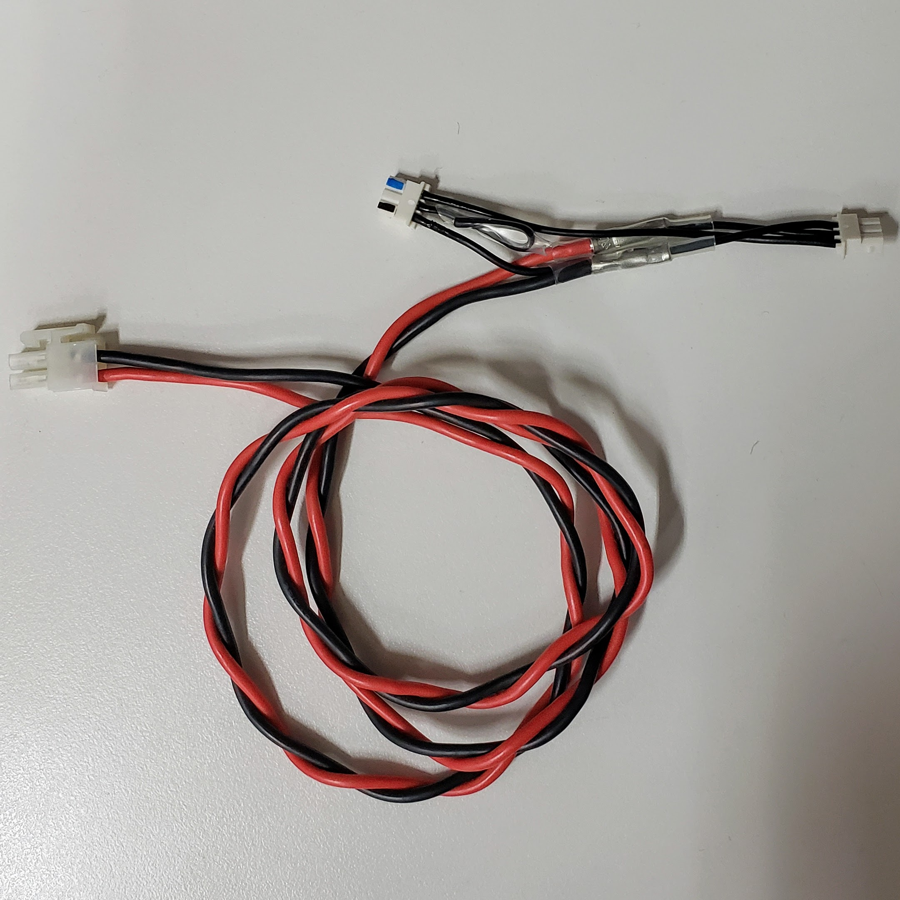
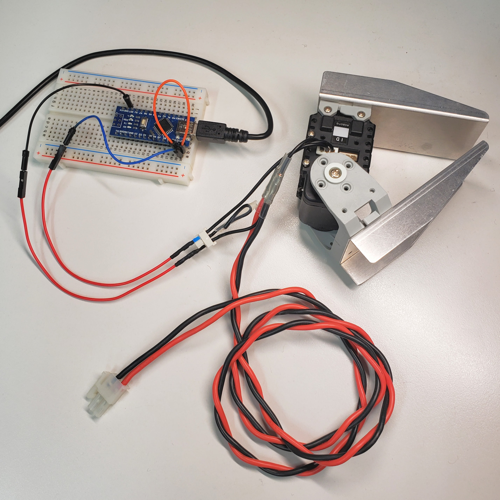
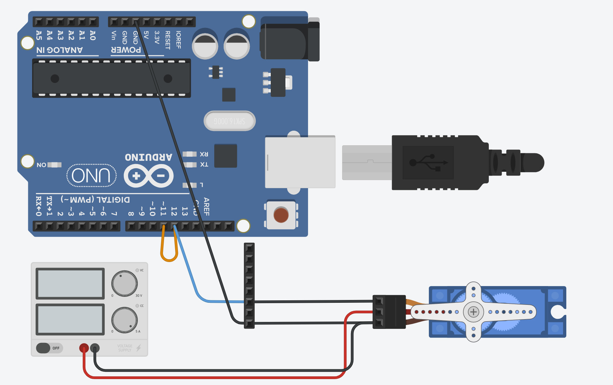
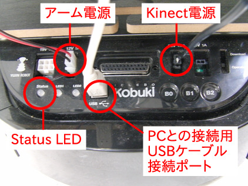

# ArduinoによるDynamixelサーボモータの制御

**本項はロボット制御とシミュレーションの演習でアームロボットのハードウェアとセットアップを行う必要があるため，
ロボット制御とシミュレーションの演習でアームロボットの実機を動かしていない場合はまずその演習資料でセットアップを行うこと．**

ロボット制御とシミュレーションの演習で説明した通り本演習ではアームロボットの制御基板(DXHUB)を介してPCからDynamixelサーボモータに指令を送っているが，
Dynamixelモータは非同期式シリアル通信の一種であるUART(半二重式)で制御されている
[^17]ため，
以下のようにDXHUBの代わりにArduino基板から制御指令を送ることもできる．

<div class="screen">

    移動台車アームロボットでの通信方法
    PC(シリアル通信プロセス) <<--USB-->>          DXHUB          <<--シリアル通信-->> サーボモータ

    ここでの通信方法
    PC(シリアル通信プロセス) <<--USB-->>       Arduino基板       <<--シリアル通信-->> サーボモータ

</div>

シリアル通信プロセスの部分は，移動台車アームロボットではdxl_armed_turtlebot_bringup.launch(がincludeしていたdynamixel_7dof_arm_bringup.launch)で起動していたROSノードであり，
ではArduinoIDEのシリアルモニタ，
夏学期のマイコン演習ではcuコマンドや自作のシリアル通信プログラムであった．

また，のようにrosserialを用いればROSの通信システムを通じてサーボモータを動かすことができるようになる．

<div class="screen">

    PC                        <<--USB-->>       Arduino基板       <<--シリアル通信-->> サーボモータ
             serial_node.py   <-rosserial->    rosserialライブラリ
     <-topic-> ROSノード群                     サーボ駆動ROSノード

</div>

ここでは以下の手順でArduinoからDynamixelモータを駆動したり，Dynamixelの回転角度をPC上でprintしてみる．

### DynamixelサーボモータのBaudRateの変更

Arduino・Dynamixel間のシリアル通信は115200で行うとよいので，BaudRateを書き換えたいサーボモータをDXHUBに接続した状態で以下のようにしてBaudRateを書き換える．
また，**DXHUBに接続して動かす際には1MHzで通信するので，使い終わったら元のBaudRateに戻しておくこと．**

<div class="screen">

``` bash
# デフォルトの1MHzからArduino通信のために115200Hzに書き換えるとき
$ rosrun dynamixel_driver set_servo_config.py 7 -p /dev/dynamixel_arm -b 1000000 -r 16

# Arduinoとの通信を終えて115200Hzからデフォルトの1MHzに戻すとき
$ rosrun dynamixel_driver set_servo_config.py 7 -p /dev/dynamixel_arm -b 115200  -r 1
```

</div>

各オプション引数の意味は以下のようになっている．

- 必須引数 ＜サーボID(複数指定可)＞

- –port(-p) ＜接続するシリアルポート＞

- –baud(-b) ＜現在のBaudRate＞

- –baud-rate(-r) ＜変更したいBaudRate＞

DynamixelはあらゆるBaudRateで通信できるわけでないため，
変更したいBaudRateは直接周波数を指定するのではなく
<https://emanual.robotis.com/docs/en/dxl/ax/ax-12a/#control-table-data-address>
の表に従って指定している．

### DynamixelサーボモータとArduinoの接続

に示すようにArduinoとDynamixelサーボモータを接続する．
回路図はに示すようになっている．
に示すようなケーブルを申し出て支給してもらう．
支給ケーブルとArduinoは以下のように接続する．

- 左下のコネクタはに示すTurtlebot背面パネルのアーム電源の場所に差す（では左下の電源装置に相当する）．

- 赤いケーブルに繋がっている方の3pinコネクタはDynamixelに接続する．（どのプログラム側でIDを指定するのでどのDynamixelでも問題ないが，最も末端に位置するグリッパのものにすると暴走した際に安全である．）

- 残った3pinネクタのGND(1番pin)をArduinoのGNDに，DATA(3番pin)をD12にブレッドボードを介して接続する．
  オス・オスジャンパー線のpinは3pinコネクタの穴より少し細いので，に示すように
  3pinコネクタ $`\leftrightarrow`$ メス・オスジャンパー線
  $`\leftrightarrow`$ オス・オスジャンパー線 $`\leftrightarrow`$
  ブレッドボードの順に接続するとよい．

- に示す橙線のようにArduinoのD11とD12をジャンパー線で接続する．

3pinコネクタのpin番号は<https://emanual.robotis.com/docs/en/dxl/ax/ax-12a/#connector-information>から読み取れる．
これらの接続により電源をTurtlebotの12V電源からサーボモータに電源を供給し，ArduinoのD11・D12pinでシリアル通信を行うことができる．
（もしサーボモータが5V駆動であればArduinoからの電源供給で駆動することができたかもしれない．）

<figure id="fig:turtlebot-back" data-latex-placement="ht">
<div class="minipage">
<div class="center">

</div>
</div>
<div class="minipage">
<div class="center">

</div>
</div>
<div class="minipage">
<div class="center">

</div>
</div>
<div class="minipage">
<div class="center">

</div>
</div>
<figcaption>Turtlebotの背面パネル (再掲)</figcaption>
</figure>

### ArduinoによるDynamixelサーボモータの駆動と関節角度の取得

[robot-programming/mechatrobot/sketchbook/dynamixel_motor_sample/dynamixel_motor_sample.ino](https://github.com/jsk-enshu/robot-programming/blob/master/mechatrobot/sketchbook/dynamixel_motor_sample/dynamixel_motor_sample.ino)をArduinoに書き込み動作動作確認を行う．
以下の関数を用意しており，loop関数の中でそれらを呼び出している．
デフォルトではread_test()関数のみコメントインされているので，他の関数を実行したいときは適宜，loop関数内でのコメントイン・アウトを入れ替える．
**まずはread_test()関数により関節角度が読み取れることを確認してからその他の関数を試すこと．**
最初にサーボを駆動しない状態でケーブルの接続やプログラムの書き込み，シリアルモニタの設定等を確かめてからサーボを動かすことで，サーボを壊す可能性を少しでも小さくすることができる．

write_test()  
一定時間間隔でサーボに角度指令を送る．

read_test()  
サーボの角度を読み取りシリアルモニタに表示する．また，150度との大小関係でArduino基板上のLEDを点灯・消灯を切り替える．
このようにLEDによる状態表示はシリアルモニタが使えない場合や設定が間違えている場合でのデバッグに有用である．

read_write_test()  
一定時間間隔でサーボに角度指令を送りつつ読み取ったサーボの角度をシリアルモニタに表示する．

<div class="screen">

``` c
#include "src/DynamixelAX12A.h"

#define BAUDRATE 115200
#define LED_PIN 13

void setup()
{
    dynamixel_setup();

    Serial.begin(BAUDRATE);

    pinMode(LED_PIN, OUTPUT);
}

float angle;
int servo_id = 7;

void write_test(){
    goal_position(servo_id, 150);
    Serial.println("move to 150 deg");
    delay(1000);

    goal_position(servo_id, 120);
    Serial.println("move to 120 deg");
    delay(1000);
}

void read_test(){
    angle = read_position(servo_id);
    if (angle < 150){
        digitalWrite(LED_PIN, HIGH);
    } else {
        digitalWrite(LED_PIN, LOW);
    }
    Serial.println(angle, DEC);
    delay(1000);
}

void read_write_test(){
    goal_position(servo_id, 150);
    Serial.println("goal:150 deg");
    delay(1000);
    angle = read_position(servo_id);
    Serial.print("current:");
    Serial.println(angle);

    goal_position(servo_id, 120);;
    Serial.println("goal:120 deg");
    delay(1000);
    angle = read_position(servo_id);
    Serial.print("current:");
    Serial.println(angle);
}

void loop()
{
    /* write_test(); */
    read_test();
    /* read_write_test(); */
}
```

</div>

### Dynamixelサーボモータとのシリアル通信プログラム

ここでは実際にDynamixelと通信しているプログラムを確認してみる． 実装は[robot-programming/mechatrobot/sketchbook/dynamixel_motor_sample/src/DynamixelAX12A.h](https://github.com/jsk-enshu/robot-programming/blob/master/mechatrobot/sketchbook/dynamixel_motor_sample/src/DynamixelAX12A.h)にあり，
このファイルは200行程度でありArduinoのライブラリを用いればその程度の長さのプログラムでサーボモータを動かせるという点にも注目したい．

例えばサーボに目標角度を送るプログラムを見てみる．
dynamixel_motor_sample.inoで呼び出しているgoal_position()関数は目標角度をfloat型で受け取るので，
それを0x00〜0x3ffまでの整数に変換してからgoal_position_raw()関数に渡している．
サーボモータへの関節角度指令の送信プログラムはこのgoal_position_raw()関数にされている．

goal_position_raw()関数では

1.  packet変数の配列にサーボモータへ送るシリアル通信のパケットを設定する

2.  packet変数の最後のchechsumを計算する

3.  send_packet()関数でサーボにシリアル通信のパケットを送信する

という流れである．

この通信はDYNAMIXEL Protocol
1.0というもので仕様は<https://emanual.robotis.com/docs/en/dxl/protocol1/>に公開されており，
自前でシリアル通信プログラムを書いて動かすことも想定されている．
DYNAMIXEL Probocol 1.0では サーボに指令を送るパケットをInstruction
Packet(目標関節角度の指令等)と呼び，サーボの状態を取得するパケットをStatus
Packetと呼ぶ(現在関節角度の取得等).

goal_position_raw()関数ではInstruction
Packetを送信しており，packet変数の中身が
<https://emanual.robotis.com/docs/en/dxl/protocol1/#instruction-packet>の仕様と一致していることが分かる．
また，checksumの計算も
<https://emanual.robotis.com/docs/en/dxl/protocol1/#checksum-instruction-packet>と一致していることも読み取れると思う．
Instruction Packetのパラメータ部分は各サーボとコマンド毎に異なるので
<https://emanual.robotis.com/docs/en/dxl/ax/ax-12a/#control-table-of-ram-area>等を確認すると，
Goal Positionのアドレス30に目標角度を2
Byteで送っている(変数position_Hとposition_Lがそれぞれ1Byte)ということも確認できる．

ここではGoal PositionとPresent
Positionの2つのコマンドのみ実装しているが，
これらの通信仕様に合わせてpacket変数を書き換えるだけで他のコマンドも送れるようになる．

<div class="screen">

``` c
int goal_position_raw(unsigned char id, int position)
{
    char position_H, position_L;
    position_H = position >> 8; // 16 bits - 2 x 8 bits variables
    position_L = position;

    const unsigned int length = 9;
    unsigned char packet[length] ={
        0xff,       // header1
        0xff,       // header2
        id,         // id
        5,          // length = instruction + address + position_L + position_H + checksum
        3,          // instruction
        30,         // P1: starting address
        position_L, // P2: target position1
        position_H, // P3: target position2
        0           // checksum
    };

    // calc sum
    for (int i = 2; i < length-1; i++)  packet[length-1] += packet[i];
    packet[length-1] = ~packet[length-1];

    return (send_packet(packet, length));
}

int goal_position(unsigned char id, float position)
{
    return goal_position_raw(id, (0x3ff & (int) (position*3.41)));
}
```

</div>

[^1]: メカトロボット: 機械工学のメカニズム，
    電気電子工学のエレクトロニクス，
    ロボット工学のロボットを掛けあわせた造語．

[^2]: Arduino Nano製品ページ: https://store.arduino.cc/usa/arduino-nano

[^3]: Arduino Nanoのピン配置:
    <https://content.arduino.cc/assets/Pinout-NANO_latest.pdf>

[^4]: ATmega328: https://avr.jp/user/DS/PDF/mega328PB.pdf

[^5]: 通称，Lチカと呼ばれ，様々なメカトロ開発のチュートリアルとして紹介されることが多い．

[^6]: センサデータシート:
    https://cdn.sparkfun.com/datasheets/Sensors/Proximity/HCSR04.pdf

[^7]: 距離センサや測距センサと呼ぶ．他の方式としては，赤外線反射を活用する光学式のものがある．

[^8]: rosserial: http://wiki.ros.org/rosserial

[^9]: ros_control: <http://wiki.ros.org/ros_control>

[^10]: http://wiki.ros.org/rviz

[^11]: <http://wiki.ros.org/rqt_joint_trajectory_controller>

[^12]: <https://docs.arduino.cc/built-in-examples/arduino-isp/ArduinoISP>

[^13]: <https://docs.arduino.cc/built-in-examples/arduino-isp/ArduinoISP#use-arduino-as-isp>

[^14]: <https://docs.arduino.cc/built-in-examples/arduino-isp/ArduinoISP#load-the-sketch>

[^15]: <https://docs.arduino.cc/built-in-examples/arduino-isp/ArduinoISP#how-to-wire-your-boards>

[^16]: <https://docs.arduino.cc/built-in-examples/arduino-isp/ArduinoISP#program-the-bootloader>

[^17]: <https://emanual.robotis.com/docs/en/dxl/protocol1/#half-duplex>
