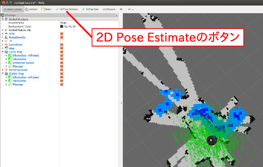
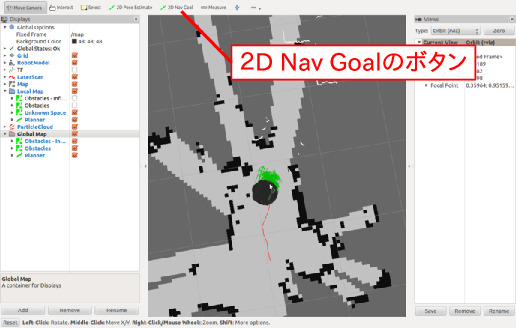

# 経路計画

前章では，地図情報が未知な状況から，
センサ値に基づきロボットが地図作成と
自己位置同定を行うサンプル実行法を紹介した．
本章では，前章の/tmp/my_mapのように
すでにある地図をロボットが活用する方法，
およびその中で経路計画する方法について説明する．
なお，**初期設定の台車移動速度は
かなり早いため，本章冒頭のロボットPCの固定は しっかりしておく．
またアームが視野内に移らないように上げておき，移動時には
ロボット・ロボットPCから外側に伸びている
ケーブルをすべて外しておく（電源のACアダプタなど）**

一度それまで起動したlaunchを落とした後jedy_bringup.launch.pyを起動した状態で，

<div class="screen">

``` bash
$ roslaunch turtlebot_navigation amcl_demo.launch map_file:=/tmp/my_map.yaml
$ roslaunch turtlebot_rviz_launchers view_navigation.launch
```

</div>

をそれぞれ別のターミナルで起動する．

まず，自己位置同定について説明する．
view_navigation.launch実行時に立ち上がるrvizには，
先ほど作成したMapが既に表示されていると思う．
中では，amcl_demo.launchの中で
map_serverというノードが/tmp/my_map.yamlを読み込み，
それに応じて/mapというtopicをpublishしている．
これにより，他のROSのノードたちが元々ファイルにかかれていた
地図情報を利用できるようになっている．
また，rvizには現在の位置にturtlebotが表示されていると思う．
これは，amcl_demo.launchの中でamcl (Adaptive Monte Carlo Localization)
という自己位置同定を行うROSノードが立ち上がり，
自己位置同定結果をpublishしているためである．
amclは，camera_nodelet_managerからscanというtopic
(Laserの代わりにkinectを用いたスキャン情報)を受け取り，
自己位置同定を行い，
結果を/amcl_poseや/particlecloudとして出力している．

さらに，自己位置同定のamclについてもう少し説明する．
rviz上で次の手順を試してもらいたい． (1) 「2D Pose
Estimate」というボタンを押す (). (2)
地図上のロボットが（実際に）いる場所にカーソルを合わせる (3)
マウス左ボタンをおすと緑矢印がでてくる． (4)
マウス左ボタンを押したままカーソルを移動させると
矢印の姿勢が変えられる． (5)
緑矢印の位置＝現在位置，矢印の姿勢＝現在姿勢
として，amclの/initialposeという
初期推定位置に関するtopicがセットされる． (6)
amclノードが/initialposeを初期値とし 自己位置同定を行い， 緑の矢印群
(particlecloud)がrviz上にでてくる． (7)
緑の矢印群は推定中の候補群であり，
時間がたつに連れ，また近傍の情報が更新されるにつれ，
どこかに収束していく． 概ね，地図上の実際ロボットがいる
位置姿勢に収束していくのが見て取れるとおもう．
もし緑矢印がなかなか収束しないようであれば，
キーボードもしくはジョイスティック操縦で
turtlebotを左右旋回・前後移動させてみよう．

<figure id="fig:move_base_plannings" data-latex-placement="h">
<div class="center">
<div class="minipage">

</div>
<div class="minipage">

</div>
</div>
<figcaption>move_baseノードによる経路計画<br />
<span> 赤線が計画結果<br />
緑の矢印群が自己位置同定の結果（particlecloudというtopic） </span>
</figcaption>
</figure>

次に経路計画について説明する． move_baseというROSノードが
/move_base_simple/goalというtopicを
目標到達位置姿勢を受け取り，経路計画を行う．
サンプル実行方法は，先ほどのrvizの上で (1) 「2D Nav
Goal」というボタンを押す (). (2)
地図上の到達させたいゴール地点にマウスを合わせる． (3)
マウス左ボタンをおすと緑矢印がでてくる． (4)
マウス左ボタンを押したままカーソルを移動させると
矢印の姿勢が変えられる． (5)
緑矢印の位置＝目標位置，矢印の姿勢＝目標姿勢として，
/move_base_simple/goalのゴールがセットされる． (6)
move_baseノードが経路計画を行い， 計画した経路にそうように
/cmd_vel_mux/input/navi_rawという 台車速度目標指令値が送られる．
なお，この指令値は キーボード・ジョイスティックおよび
EusLispの:go-velocityメソッドと同様の
台車速度指令値を送っていることになる．

途中amcl.launchの出力で

<div class="screen">

    [ WARN] [1447760799.636129036]: Could not get robot pose, cancelling reconfiguration

</div>

のようなエラー，ワーニングがでてきた場合は，amcl.launchをCtrl-cして再
度起動しなおす

