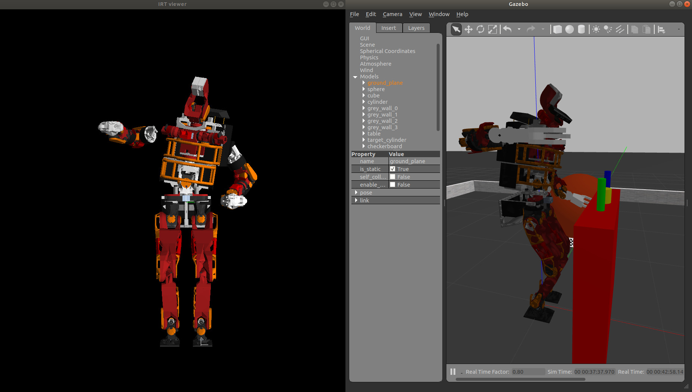
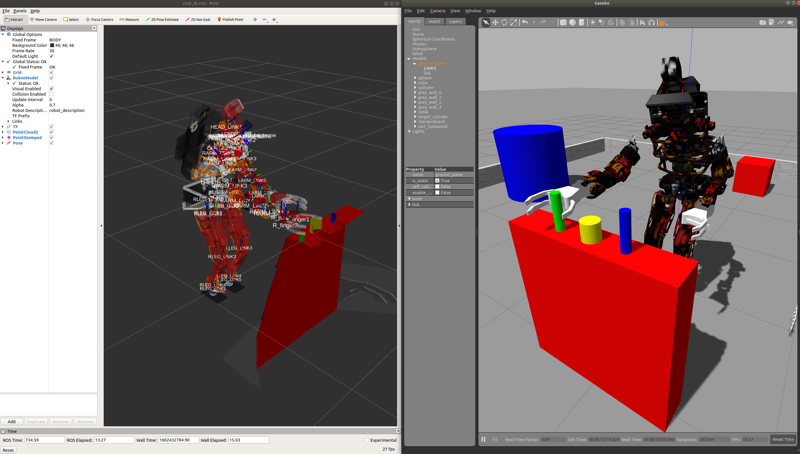

# リアルタイムIKによるオンライン操縦

本来，制御工学における「リアルタイム」「リアルタイム性」の厳密な意味は，
「特定の処理が決められた時間内に完了することが保証されている」ことを指すが，
ここでの「リアルタイムIK」は，「逆運動学計算を高速に周期実行し，入力指令に対し即時追従し続ける」という広義な意味合いであることに注意されたい．

<div class="screen">

``` bash
$ roslaunch cart_humanoid cart_humanoid_gazebo.launch
$ rosrun cart_humanoid realtime-ik-sample.l
```

</div>

とすると，irtviewerが立ち上がると同時にGazebo内のロボットが準備姿勢になる．
この状態で，以下のようにコマンドラインからtopicをpublishしてやると，
irtviewer内のロボットモデルとGazebo内のロボットが即時追従する().

<div class="screen">

``` bash
$ rostopic pub /ik_rarm_tgt geometry_msgs/PoseStamped "header:
  seq: 0
  stamp:
    secs: 0
    nsecs: 0
  frame_id: ''
pose:
  position:
    x: 0.2
    y: -0.5
    z: 0.5
  orientation:
    x: 0.0
    y: 0.0
    z: 0.0
    w: 1.0"
```

</div>

(※pdfをコピペするとインデントがくずれて正しいトピックを送れないのでコマンド入力時は適宜Tab補完を利用するとよい).

<figure id="fig:ik_pub" data-latex-placement="h">
<div class="center">

</div>
<figcaption>リアルタイムIKにより，rostopic
pubした瞬間，目標値に追従しようとする</figcaption>
</figure>

realtime-ik-sample.lの内部では，

<div class="screen">

``` lisp
(ros::subscribe "ik_larm_tgt" geometry_msgs::PoseStamped #'send self :larm-cb)
  (ros::subscribe "ik_rarm_tgt" geometry_msgs::PoseStamped #'send self :rarm-cb)
  (ros::subscribe "ik_lleg_tgt" geometry_msgs::PoseStamped #'send self :lleg-cb)
  (ros::subscribe "ik_rleg_tgt" geometry_msgs::PoseStamped #'send self :rleg-cb)
  (ros::subscribe "ik_head_tgt" geometry_msgs::PoseStamped #'send self :head-cb)
```

</div>

のようにlarm(左手)〜rleg(右足),
head(この実装ではカメラ注視点)に対する指令値を
geometry_msgs::PoseStamped型のTopicとしてsubscribeしている．

そして，指令値をlarm-tgt〜head-tgtに格納した後，
以下のようにして周期的に逆運動学を解くと同時に実ロボットに姿勢を送信している．

<div class="screen">

``` lisp
(ros::rate 10) ;; 10Hz
(while (ros::ok)
  (send *cart_humanoid* :inverse-kinematics (list larm-tgt rarm-tgt lleg-tgt rleg-tgt) ;; 四肢の目標座標
  :move-target (list                 ;; 可動部位を指定(今回は全四肢)
    (send *cart_humanoid* :larm :end-coords)
    (send *cart_humanoid* :rarm :end-coords)
    (send *cart_humanoid* :lleg :end-coords)
    (send *cart_humanoid* :rleg :end-coords))
  :translation-axis (list t t t t)   ;; 目標並進位置のうち，どの要素を追従するか(tでXYZ全て有効)
  :rotation-axis (list t t t t)      ;; 目標回転姿勢のうち，どの要素を追従するか(tでrpy全て有効)
  :stop 2                            ;; 一回の呼び出しで最大何回収束計算するか
  :revert-if-fail nil                ;; IK解が完全に収束しなくても直前の姿勢を採用するか
  :debug-view nil                    ;; デバッグ表示
  )
  (send *cart_humanoid* :look-at-target head-tgt) ;; 注視点制御のみ別関数
  (send *ri* :angle-vector (send *cart_humanoid* :angle-vector) 10) ;; 実ロボットに反映
  (send *irtviewer* :draw-objects :flush nil) ;; 以下，描画のための処理
  (dolist (tgt (list larm-tgt rarm-tgt lleg-tgt rleg-tgt head-tgt)) (send tgt :draw-on :flush nil))
  (send *irtviewer* :viewer :viewsurface :redraw)
  (ros::spin-once)
  (ros::sleep)
  )
)
```

</div>

このように，煩雑な逆運動学計算をROSノードとしてモジュール化(i.e.
カプセル化，ブラックボックス化)することで，
これ以降は様々なGUIや入力デバイスから/ik\_\*\_tgtにgeometry_msgs::PoseStamped型でデータを入力するだけで，
ヒューマノイドロボットの全身姿勢を容易に操作できるインターフェースとなる．

例えば，以下のようにclick_ik_rviz.launchを追加で起動する．
click_ik_rviz.launch は予め表示Topic等を設定したRvizの起動と，
RViz内でユーザーがマウスクリックした点(/clicked_point
geometry_msgs::PointStamped ※RViz標準機能)
を/ik_rarm_tgtと/ik_head_tgt(geometry_msgs::PoseStamped)に変換するノードを起動している．

<div class="screen">

``` bash
$ roslaunch cart_humanoid cart_humanoid_gazebo.launch
$ rosrun cart_humanoid realtime-ik-sample.l
$ roslaunch cart_humanoid click_ik_rviz.launch
```

</div>

RViz内の「Publish
Point」ボタンをクリックしてから，目標にしたいPointCloud上の一点をクリックすると，
/clicked_point ひいては /ik_rarm_tgt と /ik_head_tgt が Publish
され，Gazebo内のロボットが対象に手を伸ばす().
ただし，操縦にはコツが要るので，動作確認ができれば良い．
(Gazebo内のオブジェクト配置を初期化するなら「Ctrl+Shift+R」，ロボットの姿勢を初期化するならrealtime-ik-sample.lを上げ直すとよい)

<figure id="fig:click_ik" data-latex-placement="h">
<div class="center">

</div>
<figcaption>「Publish
Point」をクリックしてから対象物のPointCloudをクリックすると，Gazebo内のロボットが対象に手を伸ばす</figcaption>
</figure>

<div class="exercise">

ここまでのプログラムが問題なく実行できることを確認せよ．  
（IKを解いた姿勢がおかしい，物体と接触して動かない，等は問題ないものとする．）

</div>

