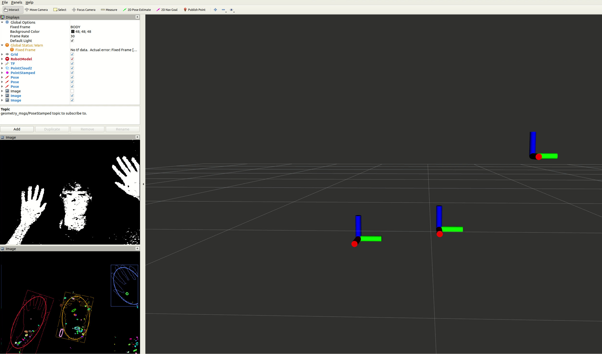
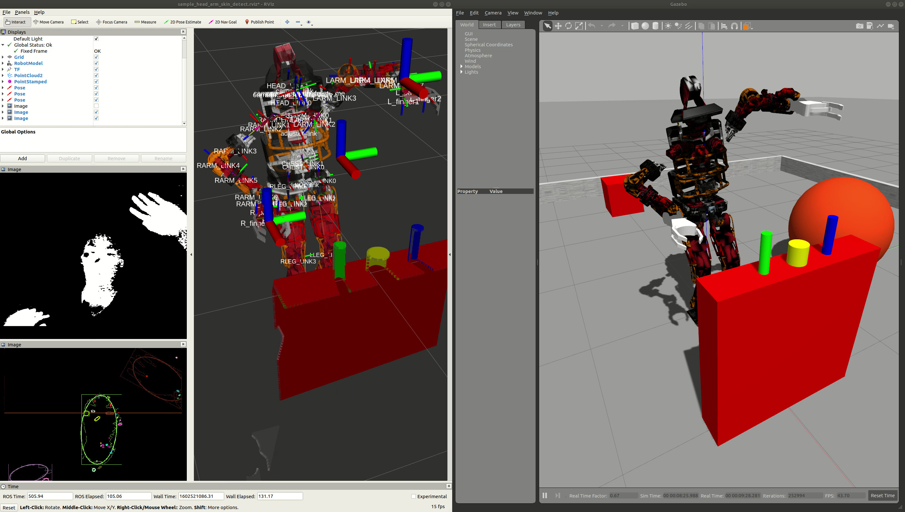

# usb_camによる簡易人体モーションキャプチャ

操縦者の身体姿勢とヒューマノイドロボットをリアルタイム同期し，
自身の体のようにヒューマノイドロボットを操縦する技術は，
アバター，マスタ・スレーブ，テレブレゼンス，テレイグジステンス，義体，などのキーワードで取り上げられる．
本来であれば，人体姿勢の3D計測が可能な手法（光学式モーションキャプチャ，装着型スーツ(IMU/変位センサ)，PointCloudデバイス(Kinect,
Xtion), VRコントローラ） 等を利用することが多い．
2D単眼カメラ画像のみしか利用できない場合，機械学習的手法(OpenPose:
https://github.com/CMU-Perceptual-Computing-Lab/openpose)などを用いて，
3次元の人体骨格姿勢を推定することになるが，計算量を要するため本演習では扱わない．

本演習では，これまでに触れてきた各種2D画像処理技術

- HSV色抽出

- 顔検出

- チェッカーボード検出

- 円・楕円・幾何形状フィッティング

- クラスタリング

- 特徴点マッチング

などの，OpenCV，ひいてはROSに実装されているツール群と，
演習用PCのインカメラを組み合わせた，簡易的なモーションキャプチャを実装する．

以降はROSのusb_cam_nodeが演習PCのインカメラを排他的に利用するため，
オンラインで演習を行っている場合は ZoomやGoogle
Meetのカメラは無効にしなければならないことに注意する．

以下のサンプルプログラムを起動してみる．

<div class="screen">

``` bash
$ roslaunch cart_humanoid sample_head_arm_skin_detect.launch
```

</div>

sample_head_arm_skin_detect.launchの中では， 以下のように，

1.  usb_camによるインカムからの2D画像取得

2.  hsv_color_filterによる肌色検出＋マスク画像生成

3.  general_contoursの楕円フィッティング機能による主要エリア検出(≒クラスタリング)

4.  skin_ellipse_area_to_ik_tgt.pyによる2D画像内位置→3D目標位置への変換

を実行できるノードを起動している．

<div class="screen">

``` xml
<node pkg="usb_cam" type="usb_cam_node" name="usb_cam">
  <param name="framerate" value="10"/>
  <param name="pixel_format" value="yuyv"/>
  </node>

  <group ns="head_arm">
  <!-- detect skin color (sample)-->
  <include file="$(find opencv_apps)/launch/hsv_color_filter.launch">
    <arg name="image" value="/usb_cam/image_raw"/>
    <arg name="debug_view" value="$(arg debug_view)"/>
    <arg name="h_limit_max" default="50"/>
    <arg name="h_limit_min" default="0"/>
    <arg name="s_limit_max" default="255"/>
    <arg name="s_limit_min" default="50"/>
    <arg name="v_limit_max" default="150"/>
    <arg name="v_limit_min" default="50"/>
  </include>
  <!-- publish ellipse fitting for head larm rarm area -->
  <include file="$(find opencv_apps)/launch/general_contours.launch">
    <arg name="image" value="hsv_color_filter/image"/>
    <arg name="debug_view" value="$(arg debug_view)"/>
  </include>
  </group>

  <!-- simple labeling on top 3 area -->
  <node pkg="cart_humanoid" type="skin_ellipse_area_to_ik_tgt.py" name="skin_ellipse_area_to_ik_tgt"
   output="screen"/>
```

</div>

general_contoursによって肌領域を楕円フィッティングした結果がpublishされるが，
larm, rarm, head や，その他のノイズ領域の区別がつかないため，
skin_ellipse_area_to_ik_tgt.py内部では以下のように面積の大きい順や，左右方向の位置によってソートする処理などが入っている．

※煩雑なので参考程度で良いが，自分で改良する場合はよく考えて理解して欲しい

<div class="screen">

``` python
unsorted_list = [ (rs.size.width * rs.size.height, rs.center.x, rs.center.y) for rs in msg.rects]
  top3_area_list = sorted([(area, x, y) for (area, x, y) in unsorted_list], reverse=True)[:3]
  pos_sorted_list = sorted([(x, y, area) for (area, x, y) in top3_area_list])
  # # sorted by X pos in image coords, and simple labeling
  # # left-most  ellipse in the image = right hand
  # # middle     ellipse in the image = face
  # # right-most ellipse in the image = left hand

  valid_area_min = 10000
  if len([area for (x, y, area) in pos_sorted_list if area > valid_area_min]) < 3:
      rospy.logwarn_throttle(1, "valid skin area < 3, keep waiting...")
      return
  else:
      rarm_pos = pos_sorted_list[0]
      head_pos = pos_sorted_list[1]
      larm_pos = pos_sorted_list[2]
```

</div>

また，2D→3Dへの変換はX(前)方向に定数(CONST_DEPTH)を仮定する簡易的なもので
roslaunch起動時に"const_depth:=0.3"のように指定できるので適宜変更して良い．

<div class="screen">

``` python
# 2D image coords [0~640, 0~480] -> 3D robot coords [CONST_DEPTH, -0.5~0.5, 0~1]
  IMAGE_W = 640.0 # [pixel]
  IMAGE_H = 480.0 # [pixel]
  CONST_DEPTH = self.const_depth # CONST_DEPTH for 2D -> 3D
  val = PoseStamped()
  val.pose.orientation.w = 1.0

  val.header.frame_id = self.frame_id
  val.pose.position.x = CONST_DEPTH
  val.pose.position.y =  (head_pos[0] - (IMAGE_W/2)) / (IMAGE_W/2) * 0.5
  val.pose.position.z = -(head_pos[1] - (IMAGE_H/2)) / (IMAGE_H/2) * 0.5 + 0.5
```

</div>

hsv_color_filterの現在のパラメータ設定は肌の色や環境の明るさに依存するので，
個々人の環境で正常に動作するようにチューニングしてみよう(→課題).

正しくチューニングされると，のように，
両手と顔に大きな楕円領域がフィッティングされ，かつその領域が3D空間上にgeometry_msgs::PoseStamoed型のTopic(/ik\_\*\_tgt)として表示されるようになる．

<figure id="fig:sample_head_arm_skin_detect" data-latex-placement="h">
<div class="center">

</div>
<figcaption>肌色検出による手，顔検出と3D空間への投影</figcaption>
</figure>

ここまでで，usb_camから人間の上肢のエンドエフェクタ姿勢をgeometry_msgs::PoseStamoed型のTopic(/ik\_\*\_tgt)でpublishするlaunchファイルと，
それらを受け取って全身のIKを実行し目標関節角を実ロボットに送信するノード，
目標関節角を受け取って動作するシミュレーション環境が揃っているので，
同時起動してみよう．

<div class="screen">

``` bash
$ roslaunch cart_humanoid cart_humanoid_gazebo.launch
$ rosrun cart_humanoid realtime-ik-sample.l
$ roslaunch cart_humanoid sample_head_arm_skin_detect.launch
```

</div>

<figure id="fig:sample_avatar" data-latex-placement="h">
<div class="center">

</div>
<figcaption>一連のプログラムを同時起動すると，簡易的なアバター操縦ができる</figcaption>
</figure>

[^1]: このように三次元形状モデルを見てロボットの位置姿勢や関節角度を変えながらソフトウェアの開発・実行をできる点が，EusLispのロボット開発言語としての強みである．

[^2]: このアームは諸君の先輩が組み立てを行ったものであり，もしかすると組み立てミスがあるかもしれない．
