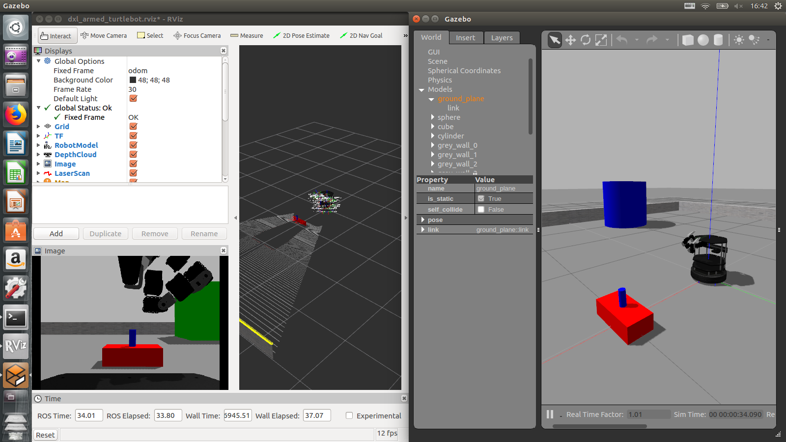
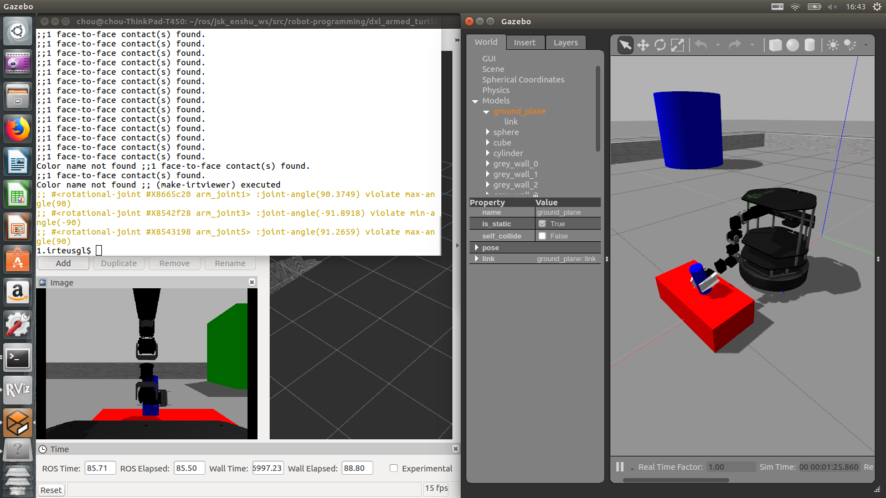
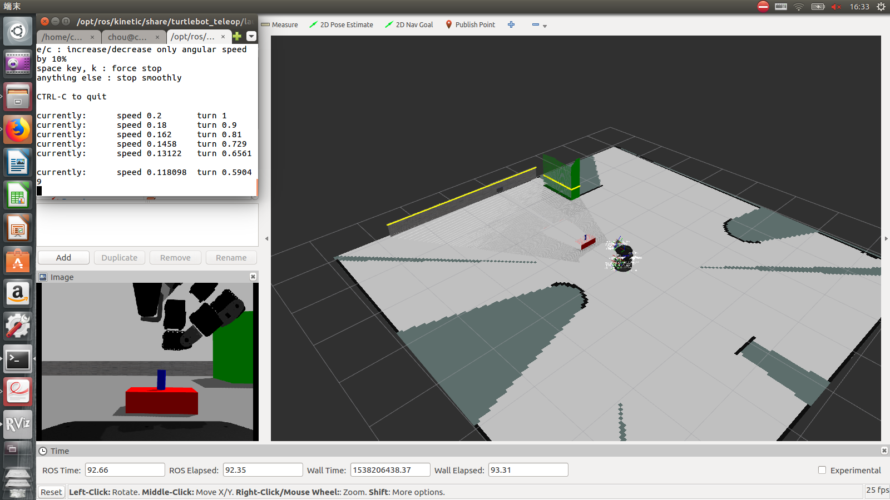
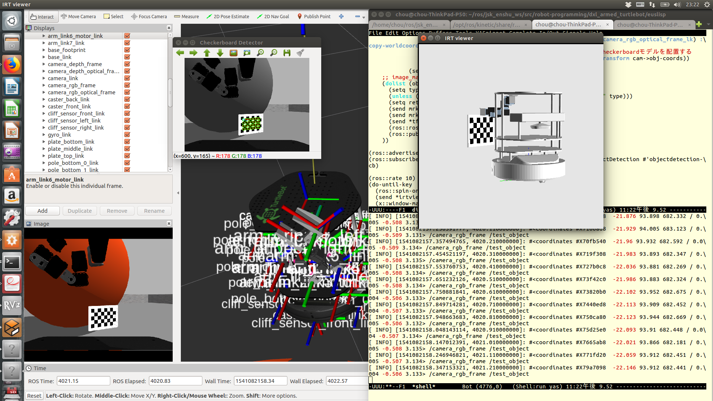

## Smaples in Gazebo

まずは、下記のコマンドを実行し、gazeboシステム及び仮想ロボットを立ち上げます
```
$ roslaunch dxl_armed_turtlebot dxl_armed_turtlebot_gazebo.launch
```

その場合、以下のような画面になりと思います。



#### 注意:
gazeboのgui (右図) を立ち上げると、PCの処理負荷が一気に上がるので、通常は`gui:=false`というオプションをつけて、rvizのみ表示させることを推奨します。
その場合、コマンドは以下のようになります。

```
$ roslaunch dxl_armed_turtlebot dxl_armed_turtlebot_gazebo.launch gui:=false
```

### 1. Grasping test in gazebo via roseus

以下のコマンドを実行し、roseusから目の前にある物体を掴んでみましょう。

```
$ roscd dxl_armed_turtlebot/euslisp
$ roseus gazebo-grasp-test.l
```

このサンプルでは、eusのロボットモデルである`*ri*`を駆使して、台車移動、アーム操作、グリッパー操作という基本動作を実行しています。
成功すると以下のようになります(gazebo guiの表示画面)。



### 2. Object recognition and approaching via roseus
前の例では、物体認識を行っておりません。物体認識を踏まえた自律動作は以下のように実行します。

1. 物体認識を実行する. これは演習で習ったもので、詳細は演習資料を参考してください。
   ```
   $ roslaunch dxl_armed_turtlebot hsi_color_filter.launch DEFAULT_NAMESPACE:=/camera/depth INPUT:=points h_min:=-120 h_max:=-20 s_min:=120
   ```
2. 認識結果を元に、自律行動を実行する
   ```
   $ roscd dxl_armed_turtlebot/euslisp
   $ roseus gazebo-grasp-with-recognition.l
   ```

### 3. SLAM in Gazebo
gazebo内でも地図作成は、実機と同様、下記のコマンドを実行するだけ:
```
$ rosrun slam_karto slam_karto
```

rviz上で、2D地図ができていることが確認できるでしょう。
ロボットの移動はroseusからでもできるが、ここでは、下記のコマンドを紹介します:
```
$ roslaunch turtlebot_teleop keyboard_teleop.launch
```
機体を一周旋回させると、以下のようになります。



### 4. Detect Checkerboard in Gazebo
gazebo内でも実機と同様にcheckerboardを検出することができる

まず、checkerboader_detectorを起動しましょう:
```
$ roslaunch roseus_tutorials checkerboard-detector.launch rect0_size_x:=0.02 rect0_size_y:=0.02 grid0_size_x:=7 grid0_size_y:=4 translation0:="0 0 0" image:=image_raw  group:=/camera/rgb frame_id:=camera_rgb_optical_frame
```


次に、上記と同じコマンドを使って、ロボットを旋回させましょう:
```
$ roslaunch turtlebot_teleop keyboard_teleop.launch
```

最後に、rviz上でchecker_boardが見つかれば、下記のコマンドでroseus上でcheckerboardを表示しましょう:

```
$ roscd dxl_armed_turtlebot/euslisp
$ roseus display-checkerboard.l
```

最終てきには、以下のようになります。




